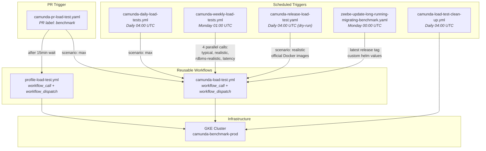

# Load Test Workflows

All load test workflows live in `.github/workflows/`. The central piece is `camunda-load-test.yml`, a reusable workflow that handles image building, cluster deployment, and load test setup. All other workflows orchestrate calls to it.

## Workflow Architecture

## Schedule Overview

| Time | Workflow | Frequency |
|---|---|---|
| 00:00 UTC Monday | `zeebe-update-long-running-migrating-benchmark.yaml` | Weekly |
| 01:00 UTC Monday | `camunda-weekly-load-tests.yml` | Weekly |
| 04:00 UTC | `camunda-daily-load-tests.yml` | Daily |
| 04:00 UTC | `camunda-release-load-test.yaml` (dry-run) | Daily |
| 04:00 UTC | `camunda-load-test-clean-up.yml` | Daily |

## Workflow Reference

### camunda-load-test.yml

The central reusable workflow. All load test creation routes through this workflow.

**Triggers:** `workflow_dispatch`, `workflow_call`

**Inputs:**

| Input | Type | Default | Description |
|---|---|---|---|
| `ref` | string | `main` | Git reference for Docker image build |
| `name` | string | *required* | Load test name (becomes K8s namespace with `c8-` prefix) |
| `ttl` | number | `1` | Days until namespace is auto-deleted |
| `reuse-tag` | string | `""` | Reuse existing Docker image tag (skips build) |
| `use-official-docker-images` | boolean | `false` | Use Docker Hub images instead of building |
| `scenario` | choice | `custom` | Workload variant: `custom`, `latency`, `realistic`, `typical`, `max` |
| `load-test-load` | string | | Helm arguments for load test components |
| `platform-helm-values` | string | `""` | Additional Helm chart values |
| `perform-read-benchmarks` | boolean | `false` | Enable read benchmarks |
| `stable-vms` | boolean | `false` | Deploy to non-spot VMs |
| `enable-optimize` | boolean | `true` | Enable Optimize |
| `build-frontend` | boolean | `false` | Build frontend |
| `secondary-storage-type` | choice | `elasticsearch` | `elasticsearch`, `opensearch`, `postgresql`, `none` |
| `publish` | string | | Where to publish results: `slack`, `comment` (workflow_call only) |

**Key jobs:** `calculate-image-tag` -> `build-camunda-image` -> `build-load-test-images` -> `calculate-scenario-config` -> `deploy`

---

### camunda-daily-load-tests.yml

Runs a daily max-load stress test against main.

**Triggers:** `schedule` (daily 04:00 UTC), `workflow_dispatch`

**Inputs:**

| Input | Type | Default | Description |
|---|---|---|---|
| `reuse-tag` | string | `""` | Reuse existing Docker image tag |

**Job chain:**
1. `benchmark-data` — generates name: `medic-daily-YYYY-MM-DD-<sha>`
2. `setup-max-load-test` — calls `camunda-load-test.yml` with scenario `max`
3. `notify` — Slack notification on failure

---

### camunda-weekly-load-tests.yml

Runs four parallel endurance tests weekly against main.

**Triggers:** `schedule` (Monday 01:00 UTC), `workflow_dispatch`

**Inputs:**

| Input | Type | Default | Description |
|---|---|---|---|
| `reuse-tag` | string | `""` | Reuse existing Docker image tag |
| `ttl` | number | `28` | Days until namespace deletion |

**Job chain:**
1. `test-data` — generates image tag: `medic-y-YYYY-cw-WW-<sha>`
2. `build-camunda-image` + `build-load-test-images` — conditional, skipped if `reuse-tag` provided
3. Four parallel load tests, each calling `camunda-load-test.yml`:
   - `setup-typical-load-test` — scenario: `typical`
   - `setup-realistic-test` — scenario: `realistic`
   - `setup-rdbms-realistic-load-test` — scenario: `realistic`, secondary-storage: `postgresql`
   - `setup-latency-test` — scenario: `latency`
4. `notify` — Slack notification on failure

---

### camunda-release-load-test.yaml

Creates load tests for official releases. Used by the release process and as a daily dry-run.

**Triggers:** `schedule` (daily 04:00 UTC as dry-run), `workflow_dispatch`

**Inputs:**

| Input | Type | Default | Description |
|---|---|---|---|
| `name` | string | *required* | Load test name |
| `tag` | string | *required* | Release tag to deploy |

**Job chain:**
1. `sanitize-inputs` — validates and sanitizes name/tag
2. `create-load-test` — calls `camunda-load-test.yml` with `use-official-docker-images: true`, scenario: `realistic`
3. `await-load-test` — waits 15 minutes
4. `delete-load-test` — deletes namespace (only on schedule, not manual dispatch)
5. `notify-on-failure` — Slack notification

---

### camunda-pr-load-test.yaml

Creates a load test when a PR is labeled with `benchmark`. Profiles the cluster and comments results on the PR.

**Triggers:** `pull_request` (events: `labeled`, `unlabeled`, `synchronize`, `closed`)

**Job chain (on label add):**
1. `sanitize-branch-name` — sanitizes PR branch name
2. `create-benchmark` — calls `camunda-load-test.yml` with scenario `max`
3. `await-benchmark` — waits 15 minutes
4. `run-profiling` — calls `profile-load-test.yml`
5. `comment-pr` — posts flamegraph results as PR comment

**Job chain (on label remove or PR close):**
1. `sanitize-branch-name` — sanitizes PR branch name
2. `delete-benchmark` — deletes the namespace

---

### profile-load-test.yml

Profiles a running load test cluster using async-profiler. Produces flamegraph artifacts.

**Triggers:** `workflow_dispatch`, `workflow_call`

**Inputs:**

| Input | Type | Default | Description |
|---|---|---|---|
| `name` | string | *required* | Load test namespace name |
| `pod` | string | `""` | Pod to profile (empty = all 3 pods) |
| `profiler_options` | string | `""` | Additional async-profiler flags |

**Jobs (mutually exclusive):**
- `profile-all-pods` — profiles 3 pods in parallel (cpu, wall, alloc events)
- `profile-single-pod` — profiles one pod with cpu event

**Artifacts:** Uploads `flamegraph-{event}-{pod}` artifacts.

---

### camunda-load-test-clean-up.yml

Deletes expired load test namespaces based on TTL labels.

**Triggers:** `schedule` (daily 04:00 UTC), `workflow_dispatch`

**Inputs:**

| Input | Type | Default | Description |
|---|---|---|---|
| `date` | string | *today* | Delete namespaces with deadline on or before this date |

**Jobs (parallel):**
- `delete-load-tests-legacy` — cleans up legacy GKE namespaces (Google Cloud auth)
- `delete-load-tests` — cleans up new infrastructure namespaces (Teleport auth)

Both post Slack notifications listing deleted namespaces.

---

### zeebe-update-long-running-migrating-benchmark.yaml

Updates the rolling release benchmark weekly with the latest release tag.

**Triggers:** `schedule` (Monday 00:00 UTC), `workflow_dispatch`

**Job chain:**
1. `fetch-release` — fetches latest release tag from GitHub API
2. `update-long-running-migrating-benchmark` — calls `camunda-load-test.yml` with name `release-rolling` and custom Helm values for realistic load

## Branch Availability

For how workflow file names differ across stable branches, see [directory-structure.md](directory-structure.md).

| Workflow | stable/8.6-8.7 | stable/8.8 | stable/8.9+ / main |
|---|---|---|---|
| `camunda-load-test.yml` | `zeebe-benchmark.yml` (renamed) | `zeebe-benchmark.yml` (renamed) | `camunda-load-test.yml` |
| `camunda-pr-load-test.yaml` | `zeebe-pr-benchmark.yaml` (renamed) | `zeebe-pr-benchmark.yaml` (renamed) | `camunda-pr-load-test.yaml` |
| `camunda-daily-load-tests.yml` | present | present | present |
| `camunda-weekly-load-tests.yml` | present | present | present |
| `camunda-release-load-test.yaml` | present | present | present |
| `camunda-load-test-clean-up.yml` | present | present | present |
| `profile-load-test.yml` | present | present | present |
| `zeebe-update-long-running-migrating-benchmark.yaml` | present | present | present |
