# Camunda Helm Chart Release Process

The charts are built, linted, and tested on every push to the main branch. If the chart version
(in `Chart.yaml`) changes a new GitHub release with the corresponding packaged helm chart is
created. The charts are hosted via GitHub pages and use the release artifacts. We use the
[chart-releaser-action](https://github.com/helm/chart-releaser-action) to release the charts.

## Snapshot

For debugging and advanced testing purposes, we provide a snapshot chart from the unreleased changes on the `main` branch (never use it in production or stable environments).

It will be always updated with the fixed version name like `0.0.0-snapshot-latest` (the tag needed to start with SemVer because Helm requires it).

### Latest

The latest unreleased changes version has rolling version `0.0.0-snapshot-latest`:

```shell
helm template my-camunda-devel \
  oci://ghcr.io/camunda/helm/camunda-platform \
  --version 0.0.0-snapshot-latest
```

### Alpha

The Alpha version is available in two flavors:

Rolling version `0.0.0-snapshot-alpha` (always pointing to the Camunda latest alpha release):

```shell
helm template my-camunda-devel \
  oci://ghcr.io/camunda/helm/camunda-platform \
  --version 0.0.0-snapshot-alpha
```

Fixed version like `0.0.0-8.6.0-alpha2` (it will be updated according to the Camunda latest alpha release):

```shell
helm template my-camunda-devel \
  oci://ghcr.io/camunda/helm/camunda-platform \
  --version 0.0.0-8.6.0-alpha2
```

## Minor Version Chores

Typically, Camunda releases a minor version every 6 months (with some exceptions, the cycle could be 3 months). From the Helm side, we need to reflect the changes in this repo.

Follows the list of changes that should be done for the minor version release. Assuming that `current alpha is 8.9` (which will be the `latest`) and the `new alpha is 8.10`, do the following:

**Before starting:**

1. Label all existing PRs with `backport-to-latest` so people know their PRs need to be updated.

**Chart files updates:**

1. Copy the current alpha chart dir `charts/camunda-platform-8.9` as the new alpha `charts/camunda-platform-8.10`
2. Update the chart version in the current alpha `charts/camunda-platform-8.9/Chart.yaml` (remove the alpha part so if old is `14.0.0-alpha5`, the new is `14.0.0`)
3. Update the image tags in the current alpha `charts/camunda-platform-8.9/values-latest.yaml` (no `SNAPSHOT` should be used)
4. Update the chart version in the new alpha `charts/camunda-platform-8.10/Chart.yaml` (increase the major version and reset the alpha version, so if old is `14.0.0-alpha5`, the new is `15.0.0-alpha1`)

**Other files updates:**

1. Update [chart-versions.yaml](../charts/chart-versions.yaml) file
2. Update Release-Please config [release-please-config.json](../.github/config/release-please/release-please-config.json) and manifest [.release-please-manifest.json](../.github/config/release-please/.release-please-manifest.json)
  - Add the new alpha (8.10 in this case) to the config and manifest files.
  - In the RP config file, remove the alpha config from the current alpha (8.9 in this case), which will be released as stable.
3. Update Renovate configuration file [renovate.json5](../.github/renovate.json5)
4. Update GitHub Actions with input of versions (search in the repo for `type: choice`)
5. Update GitHub Action for snapshot artifact [chart-release-snapshot.yaml](../.github/workflows/chart-release-snapshot.yaml)
6. Update GitHub Action PR labeler config file [pr-labeler.yaml](../.github/config/pr-labeler.yaml) and add the new version.
7. Update docs/release.md file with the new version in examples.

**Finally, create a PR with the changes, and once merged, follow the normal release process.
**

## Release Process

We are trying to automate as much as possible of the release process yet without sacrificing
transparency so we are using PR release flow with minimal manual interactions.

> [!NOTE]
>
> The release notes depend on git commit log, only the commits that follow
[Conventional Commits](https://www.conventionalcommits.org/en/v1.0.0/) format) will be added to
the release notes.

```mermaid
graph TD
    Step1[Step1<br/>Semi-Automated<br/>---<br/>The release manager ensures that all <a href="https://github.com/camunda/camunda-platform-helm/pulls?q=is%3Aopen+is%3Apr+label%3Adependencies">dependences</a> are updated via Renovatebot]
    Step2[Step2<br/>Semi-Automated<br/>---<br/>The release manager triggers <a href="https://github.com/camunda/camunda-platform-helm/actions/workflows/chart-release-candidate.yaml">GitHub Action</a> to create the release candidate]
    Step3[Step3<br/>External<br/>---<br/>The QA team reviews the release candidate artifact and gives the green light to release]
    Step4[Step4<br/>Automated<br/>---<br/>GitHub Action with Release-Please creates the release PR]
    Step5[Step5<br/>Automated<br/>---<br/>GitHub Action runs release chores, like release notes, and pushes the commit to the release PR]
    Step6[Step6<br/>Manual<br/>---<br/>The release manager reviews the release PR]
    Step7[Step7<br/>Manual<br/>---<br/>The release manager adds 'release' label to the release PR]
    Step8[Step8<br/>Automated<br/>---<br/>GitHub Action releases the Helm chart]
    Step9[Step9<br/>Manual<br/>---<br/>The release manager merges the release PR to main branch]

    Step1 ==> Step2
    Step2 == The GHA creates 'release-candidate-VERSION' branch and OCI artifact ==> Step3
    Step3 ==> Step4
    Step4 ==> Step5
    Step5 ==> Step6
    Step6 ==> Step7
    Step7 ==> Step8
    Step8 ==> Step9
```



## Artifact Hub

[Camunda repo](https://artifacthub.io/packages/search?repo=camunda) is already configured on
Artifact Hub. Once the release workflow is done, Artifact Hub automatically scans the Camunda Helm repo
and the new release will show on Artifact Hub.

> [!NOTE]
>
> The charts could take some time till shown on Artifact Hub (up to 30 min).
> But we sharing our Helm chart on Artifact Hub just for visibility. After successful release,
> our Helm charts are immediately available via [Camunda Helm Repo](https://helm.camunda.io).
