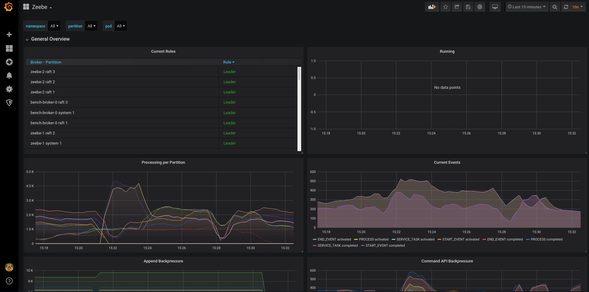

# Monitoring

## Metrics

Zeebe exports several metrics to facilitate monitoring a cluster.
Currently, metrics are exported using Prometheus. You can find
documentation about the different metrics
[here](https://docs.camunda.io/docs/product-manuals/zeebe/deployment-guide/operations/metrics).

### Testing

You can easily test metrics locally by using the standard provided [docker compose
file](../docker/compose/docker-compose.yaml) in combination with the one [here](docker-compose.yml), e.g.:

```sh
docker-compose --project-directory ./ -f docker-compose.yml -f ../docker/compose/docker-compose.yaml up -d
```

This will start the usual 3 brokers cluster, as well as a Grafana [instance](http://localhost:3000/) (on port 3000; login: u `admin`, p `camunda`) and a Prometheus instance on
port 9090. The Prometheus instance is configured to scrape the brokers every 5 seconds, and pre-assigns them the
namespace and pod label as `local` and `broker-*`.

> Remember that docker-compose does not remove volumes on the down command, so if you are completely done with it you
> will need to run either `docker-compose --project-directory ./ -f docker-compose.yml -f ../docker/compose/docker-compose.yaml down -v`
> or `docker volume prune`

### Testing with local Zeebe

When you want to use a local Zeebe Broker, you need to locally modify the config:
- enable Prometheus Docker container to access localhost ports:

```yaml
# add to the prometheus service
extra_hosts:
- "host.docker.internal:host-gateway"
```

- add the local Zeebe broker to Prometheus config:

  ```yaml
  # add to scrape_configs
  - job_name: 'zeebe_local'
    metrics_path: /actuator/prometheus
    static_configs:
         - targets: ['host.docker.internal:9600']

  ```

### Grafana

You can find [here](grafana/zeebe.json) a pre-built Grafana dashboard to
visualize most metrics. This is the dashboard that we use to test and
monitor our own Zeebe installations.

> NOTE: this dashboard is used for development and can serve as a
> starting point for your own dashboard, but may not be tailored for your
> particular use case.

See the Grafana documentation on
[how to import a dashboard](https://grafana.com/docs/grafana/latest/reference/export_import/#importing-a-dashboard).

#### Variables

The dashboard at the moment has most visualizations scoped to the
following variables: `namespace` (the k8s namespace), `pod` (the k8s pod),
and [partition](https://docs.camunda.io/docs/product-manuals/zeebe/technical-concepts/partitions).

#### Contributing

If you modify the dashboard, you can modify it using Grafana.

1) In edit mode, save it as a a copy
2) Then exit edit mode and make sure to export as described
[here](https://grafana.com/docs/grafana/latest/dashboards/share-dashboards-panels/#export-a-dashboard-as-json),
checking `Export the dashboard to use in another instance` as you do.

#### Preview



