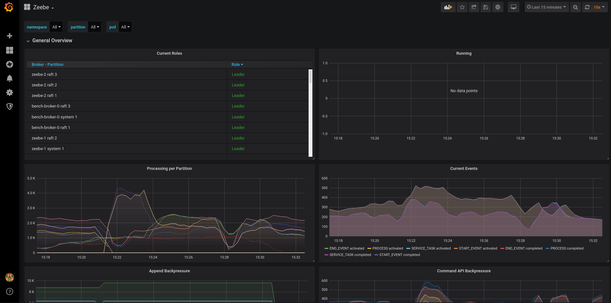

# Monitoring

## Metrics

Zeebe and other Camunda components export metrics to facilitate monitoring a cluster using Prometheus. Documentation for the available metrics can be found [here](https://docs.camunda.io/docs/product-manuals/zeebe/deployment-guide/operations/metrics).

## Grafana

We use Grafana to visualize our metrics in dashboards for monitoring and troubleshooting purposes. You can find general information about Grafana [here](https://grafana.com/docs/grafana/latest/fundamentals/).

### Running Grafana locally

Start the Grafana and Prometheus stack with Docker Compose. Requires [Docker Desktop](https://docs.docker.com/desktop/) on Windows and macOS, or Docker with the Compose plugin on Linux.

Run the following from the `monitor/` directory:

```sh
# Start
docker compose --project-directory ./ -f docker-compose.yml up -d

# Stop
docker compose --project-directory ./ -f docker-compose.yml down

# Stop and remove volumes
docker compose --project-directory ./ -f docker-compose.yml down -v
```

On **macOS and Linux** you can also use the Makefile shortcuts: `make up`, `make down`, `make clean`.

On **Windows** the `make` command is not available by default — use the `docker compose` commands above directly in PowerShell.

Grafana is available at http://localhost:3000 (admin / camunda), Prometheus at http://localhost:9090.

Once the stack is running, open http://localhost:3000 to access Grafana. Dashboards are loaded from the JSON files under `grafana/dashboards/` and are editable in the UI without restrictions.

#### Dashboard file sync

The dev overlay (`docker-compose.dev.yml`) includes a `dashboard-sync` sidecar that polls the Grafana API every 10 seconds and writes any UI edits back to the corresponding JSON file on disk. Start it alongside the main stack:

```sh
docker compose --project-directory ./ -f docker-compose.yml -f docker-compose.dev.yml up -d
```

With this running, the edit loop is: open `grafana/dashboards/core-features/overview.json` (or any dashboard), save changes in the Grafana UI, and the JSON file is updated within ~10 seconds. Changes are then visible in your editor and ready to commit.

The sidecar matches files to Grafana dashboards by the `uid` field. When writing synced content back to disk it preserves the `id` and `version` values from the local file rather than overwriting them with Grafana's internal values, and excludes both fields from the comparison so they never trigger a spurious sync.

**Grafana-managed fields** — Grafana automatically modifies certain fields in dashboard JSON that have no meaning outside the running instance and should not be manually edited:

- `id` — a numeric internal DB ID assigned per Grafana installation. Preserved from the local file by the sync; do not set it manually.
- `version` — a save counter incremented on every edit. Preserved from the local file by the sync; do not set it manually.
- `pluginVersion` inside panel objects — updated to the running Grafana version on load. After a Grafana version upgrade the first sync will rewrite these values throughout the file; commit the resulting changes so subsequent startups produce no diff.

#### Generating test data

The Camunda container (Zeebe, Operate, and Tasklist unified) exposes JVM, broker, Operate, and Tasklist metrics immediately on startup. For process- and job-level metrics you need actual workload running.

The dev overlay also includes a `traffic-generator` that deploys a simple process and creates one instance every 10 seconds (see above for the start command). The test process (`processes/test-process.bpmn`) has a single service task of type `test-job`; because no worker completes the job, instances accumulate at the task — making job backlog and active instance metrics visible in the dashboards. Requires Zeebe 8.3 or later for the REST API.

The dev overlay also runs a **`metrics-generator`** — a small Node.js service built from `metrics-generator/` that exposes synthetic Prometheus metrics on port 9400. It generates realistic metrics across three synthetic environments (`local`, `staging`, `production`) with the full label schema the dashboards expect (`namespace`, `cluster`, `pod`, `partition`, `application`, etc.), including counters that increase over time so `rate()` and `increase()` panels render correctly. This makes dashboard template variables (e.g. the `namespace`, `cluster`, `geo_area`, `provider` dropdowns) populate immediately with multiple selectable values. The image is built locally on first `docker compose up`; if you modify `metrics-generator/generator.js` you must rebuild it explicitly:

```sh
docker compose --project-directory ./ -f docker-compose.yml -f docker-compose.dev.yml up -d --build metrics-generator
```

The synthetic data covers all sections of the `core-features/overview` dashboard (except Legacy Operate/Tasklist and Optimize), including `kube_namespace_labels` for the template variable dropdowns (`namespace`, `geo_area`, `cloud_provider`, `generation`, `sales_plan_type`) and the `node_namespace_pod_container:*` infrastructure metrics via the recording rules in `prometheus/recording_rules.yml`. No real Kubernetes cluster is needed.

For **realistic, diverse test data** across all dashboards (process instances in various states, incidents, decisions, user tasks, multiple tenants), activate the `dev-data` Spring profile. The unified Camunda image already bundles the Operate and Tasklist data generators, so enabling the profile is a one-line change in `docker-compose.yml`:

```yaml
environment:
  - SPRING_PROFILES_ACTIVE=consolidated-auth,tasklist,broker,operate,dev-data
```

Restart the stack after making this change. The data generators run on startup and populate Elasticsearch with representative process and task data.

#### Keeping generator metrics in sync

The `metrics-generator` only produces metrics the real Camunda container does not — mainly Kubernetes infrastructure metrics. Run `scripts/check-metrics.js` to verify the split is clean:

```sh
node scripts/check-metrics.js
```

The script scrapes both `http://localhost:9600/actuator/prometheus` (Camunda) and `http://localhost:9400/metrics` (generator) and reports three categories:

- **OVERLAPS** — Both the real container and the generator expose this metric family; Grafana will double-count it.
  Remove the metric from `generator.js`, then rebuild with `--build metrics-generator`.
- **LABEL GAPS** — The generator produces the metric but is missing labels that the real service uses.
  Extend the `labelNames` array for that metric in `generator.js` and rebuild.
- **MISSING FAMILIES** — The real container exposes a metric family the generator does not.
  Usually no action needed — the generator is intentionally supplemental. Only add a metric to `generator.js` if a dashboard panel needs it **and** the real container cannot provide it (e.g. Kubernetes-level infrastructure metrics).

**When to run this script:**

- After bumping `CAMUNDA_VERSION` in `docker-compose.yml` — a new release may add metrics that overlap with what the generator already produces.
- When a Grafana panel shows unexpectedly high values, which is a symptom of double-counting from an overlap.
- When adding new application metrics to the Camunda codebase, to confirm the real container covers them without generator duplication.

New application metrics added to Camunda generally do **not** require generator changes — the real container exposes them directly. Generator changes are only needed when the metric lives outside the application (Kubernetes, Elasticsearch cluster health, etc.) and a dashboard panel depends on it.

### Creating a new dashboard (Camunda internal)

This is a step-by-step guide for creating a new Grafana dashboard, but especially the deployment steps may also be relevant for modifying existing dashboards.

This guide focuses on making use of existing metrics to create visualizations in Grafana.
If you want to learn how to add new metrics, a good starting point can be found in the observability documentation [here](../docs/observability/metrics.md).

#### Prerequisites

**Write access** for a (team) folder in a development Grafana instance (e.g. [dev](https://grafana-central.internal.dev.ultrawombat.com/) or [internal SaaS](https://grafana-central.internal.camunda.io/) environment). To get access, ask your team lead or the SRE team.

*or*

A **local Grafana** instance via the local stack described above. Use `make up-dev` (macOS/Linux) or the equivalent `docker compose` command with both compose files. The `dashboard-sync` sidecar writes UI saves back to the JSON files automatically — no manual export needed.

> **Deprecated (macOS/Linux only):** [Grizzly](https://grafana.com/blog/2024/10/29/edit-your-git-based-grafana-dashboards-locally/) was previously used to serve dashboards locally via `make grizzly`. It is archived and no longer maintained (August 2025) and has no Windows support. Use the local stack above instead.

For this guide the assumption is that you are using a shared Grafana instance.

#### Creating the dashboard

1) In Grafana, navigate to the desired folder and select `"New" > "Dashboard"` (or `"Import"` if you have an existing Dashboard that you want to use as a blueprint as described [here](https://grafana.com/docs/grafana/latest/reference/export_import/#importing-a-dashboard)).
2) Go to "Settings" to modify the dashboard title, description, tags, etc. Follow the best practices described in the dashboards repository [readme](https://github.com/camunda/grafana-dashboards) and [dashboard issue template](https://github.com/camunda/grafana-dashboards/blob/main/.github/ISSUE_TEMPLATE/new-dashboard.md).
3) Save the dashboard (this automatically sets a UID)
4) Go back into edit mode for the dashboard and navigate to `"Settings" > "JSON Model"` and look for the `"uid"`. Set a unique but sensible UID (e.g. "teamname-dashboardname") and save the dashboard again.
5) Create or edit variables (in the dashboard settings), panels and sections as needed.

#### Creating visualizations

This guide does not go into details about creating visualizations, but these are some helpful resources and tips to get started:

* You can find the official documentation for creating visualizations on the Grafana website [here](https://grafana.com/docs/grafana/latest/visualizations/panels-visualizations/visualizations/)
* By default, we use [Prometheus](https://prometheus.io/) to collect metrics. Consequently, the queries for our dashboards are written in [PromQL](https://prometheus.io/docs/prometheus/latest/querying/basics/). Familiarize yourself with the basics of it before getting started - especially the different metrics data types since those are relevant for choosing the right visualization type.
* Build queries iteratively "from the inside out": Start with just the metric you want to display and understand what it represents even if you already have the operators you want to use on it in mind.
* Think of metrics as database queries. If there is a way you would want to operate on the data in SQL, it probably also exists in PromQL - including joins on other metrics.
* There is always some small way to improve every panel you make, either through refining the queries or tweaking little parts of how it's visualized. At some point you need to make the decision that it's good enough, push it, and then iterate over it later with feedback from actual usage.

#### Exporting the dashboard

**If you used the local stack with `dashboard-sync`:** the JSON file is already written back to `grafana/dashboards/` within ~10 seconds of each UI save. No manual export is needed — just commit the file.

**If you used a shared Grafana instance:**

1) Save your modifications (if you are editing an already deployed dashboard, save it as a copy to ensure it does not get overwritten by a new deployment from code)
2) Exit edit mode and export as described [here](https://grafana.com/docs/grafana/latest/dashboards/share-dashboards-panels/#export-a-dashboard-as-json), checking `Export the dashboard to use in another instance`.
3) Save the dashboard JSON in the codebase under [grafana/dashboards](grafana/dashboards) — create a folder for your team if it does not exist yet. Ensure the filename, dashboard name, and UID are correct.
4) Delete the copied dashboard (if one was created).

**Note**: If you edit an already existing dashboard, keep in mind that it may get automatically deployed once it was merged into the code base (see next section).

#### Dashboard Deployment

Our dashboards are deployed from the [grafana-dashboards repository](https://github.com/camunda/grafana-dashboards). You can follow the information there for creating new dashboards or folders, which also includes some best practices for designing Grafana dashboards that should be followed before deployment.
Some dashboards are directly maintained in that repository (e.g. SRE and Controller) and need to be updated there. Others (e.g. Zeebe, Data Layer and Core Features) are defined and maintained in this repository in the [grafana folder](grafana) and get fetched by linking the raw Github content of the dashboard definition like:

```yaml
apiVersion: v1
kind: ConfigMap
metadata:
  name: example-dashboard
data:
  example-dashboard.json.url: https://raw.githubusercontent.com/camunda/camunda/main/monitor/grafana/dashboards/example-team/example-dashboard.json
```

You can refer to existing dashboards in that repository for examples if you are deploying a new dashboard, or use it to check where the deployed dashboards are maintained.

**Note**: The Zeebe team maintains an own Grafana deployment for [reliability testing](/docs/testing/reliability-testing.md). In case of dashboard deletion, check their deployment definition in the [zeebe-infra repository](https://github.com/camunda/zeebe-infra/blob/main/gcp/zeebe-io/zeebe-cluster/monitoring/kube-prometheus-stack.yml) to ensure it is not referenced there.

### Example Dashboard: Zeebe

You can find a pre-built Grafana dashboard [here](grafana/zeebe.json) to
visualize most metrics. This is the dashboard that we use to test and
monitor our own Zeebe installations.

> NOTE: this dashboard is used for development and can serve as a
> starting point for your own dashboard, but may not be tailored for your
> particular use case.



