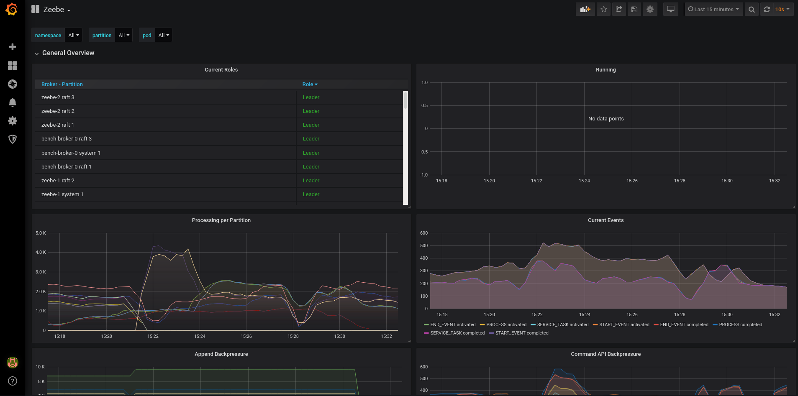

# Monitoring

## Metrics

Zeebe and other Camunda components export several metrics to facilitate monitoring a cluster.
Currently, metrics are exported using Prometheus. You can find
documentation about the different Zeebe metrics
[here](https://docs.camunda.io/docs/product-manuals/zeebe/deployment-guide/operations/metrics).

## Grafana

We use Grafana to visualize our metrics in dashboards for monitoring and troubleshooting purposes. You can find general information about Grafana [here](https://grafana.com/docs/grafana/latest/fundamentals/).

Dashboards are stored as JSON files in the [grafana](grafana) folder. You can edit these dashboards:

1. Either directly through Grafana, which creates a pull request automatically on your behalf (see below).
2. Or by manually editing the JSON files.

### Editing a dashboard through Grafana

Only [Grafana in the benchmark environment](https://dashboard.benchmark.camunda.cloud/dashboards) supports
this. Using its [Git Sync](https://grafana.com/docs/grafana/latest/as-code/observability-as-code/git-sync/)
functionality, changes are saved back into GitHub automatically:

1. Open the list of dashboards at https://dashboard.benchmark.camunda.cloud/dashboards
2. In the **`camunda/camunda`** folder, select the dashboard to edit
3. Edit the dashboard as needed
4. Click "Save":
   1. Pick a branch name (e.g. `grafana/xxx`), add a comment explaining the change, and click "Save"
      again.
   2. Grafana commits to a new branch and displays a link to open the change as a pull request.
   3. Click on the link to create the pull request; adjust the title and description as needed.

Grafana automatically updates the pull request with links back to the dashboard and screenshots of the
changes made (this can take up to 1 minute).

### Editing the dashboard files directly

You can also edit the dashboard JSON files under [grafana](grafana) directly and open a pull request as
usual. Grafana still reacts automatically and posts links and screenshots of the changes to the pull request.

Either way, once the pull request is merged, the change is reflected in Grafana automatically.

### Creating visualizations

* You can find the official documentation for creating visualizations on the Grafana website [here](https://grafana.com/docs/grafana/latest/visualizations/panels-visualizations/visualizations/)
* By default, we use [Prometheus](https://prometheus.io/) to collect metrics. Consequently, the queries for our dashboards are written in [PromQL](https://prometheus.io/docs/prometheus/latest/querying/basics/). Familiarize yourself with the basics of it before getting started - especially the different metrics data types since those are relevant for choosing the right visualization type.
* Build queries iteratively "from the inside out": Start with just the metric you want to display and understand what it represents even if you already have the operators you want to use on it in mind.
* Think of metrics as database queries. If there is a way you would want to operate on the data in SQL, it probably also exists in PromQL - including joins on other metrics.
* There is always some small way to improve every panel you make, either through refining the queries or tweaking little parts of how it's visualized. At some point you need to make the decision that it's good enough, push it, and then iterate over it later with feedback from actual usage.

### Dashboard Deployment

Some dashboards (e.g. SRE and Controller) are directly maintained in the [grafana-dashboards repository](https://github.com/camunda/grafana-dashboards) and need to be updated there. Others (e.g. Zeebe, Data Layer and Core Features) are defined and maintained in this repository in the [grafana folder](grafana) and get fetched by linking the raw GitHub content of the dashboard definition like:

```yaml
apiVersion: v1
kind: ConfigMap
metadata:
  name: example-dashboard
data:
  example-dashboard.json.url: https://raw.githubusercontent.com/camunda/camunda/main/monitor/grafana/dashboards/example-team/example-dashboard.json
```

You can refer to existing dashboards in that repository for examples if you are deploying a new dashboard, or use it to check where the deployed dashboards are maintained.

**Note**: The Zeebe team maintains an own Grafana deployment for [reliability testing](/docs/testing/reliability-testing.md). In case of dashboard deletion, check their deployment definition in the [zeebe-infra repository](https://github.com/camunda/zeebe-infra/blob/main/gcp/zeebe-io/zeebe-cluster/monitoring/kube-prometheus-stack.yml) to ensure it is not referenced there.

### Example Dashboard: Zeebe

You can find a pre-built Grafana dashboard [here](grafana/zeebe.json) to
visualize most metrics. This is the dashboard that we use to test and
monitor our own Zeebe installations.

> NOTE: this dashboard is used for development and can serve as a
> starting point for your own dashboard, but may not be tailored for your
> particular use case.



## Local testing environment

The [local-env](local-env) folder contains a Docker Compose setup with Prometheus, Grafana, and a
Zeebe broker, for testing locally that metrics are exported and scraped correctly. This setup is
not used to edit the dashboards shown in the benchmark environment; use Git Sync as described
above for that. See [local-env/README.md](local-env/README.md) for usage.
