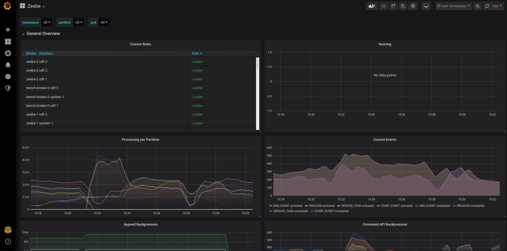

# Monitoring

## Metrics

Zeebe and other Camunda components export several metrics to facilitate monitoring a cluster.
Currently, metrics are exported using Prometheus. You can find
documentation about the different Zeebe metrics
[here](https://docs.camunda.io/docs/product-manuals/zeebe/deployment-guide/operations/metrics).

### Testing

> [!NOTE]
> This local setup tests that metrics are exported and scraped correctly. To edit dashboards, use the
> method described in [Editing a dashboard through Grafana](#editing-a-dashboard-through-grafana).

You can easily test metrics locally by using the standard provided [docker compose
file](../docker/compose/docker-compose.yaml) in combination with the one [here](docker-compose.yml), e.g.:

```sh
docker-compose --project-directory ./ -f docker-compose.yml -f ../docker/compose/docker-compose.yaml up -d
```

This will start the usual 3 brokers cluster, as well as a Grafana [instance](http://localhost:3000/) (on port 3000; login: u `admin`, p `camunda`) and a Prometheus instance on
port 9090. The Prometheus instance is configured to scrape the brokers every 5 seconds, and pre-assigns them the
namespace and pod label as `local` and `broker-*`.

> Remember that docker-compose does not remove volumes on the down command, so if you are completely done with it you
> will need to run either `docker-compose --project-directory ./ -f docker-compose.yml -f ../docker/compose/docker-compose.yaml down -v`
> or `docker volume prune`

### Testing with local Zeebe

When you want to use a local Zeebe Broker, you need to locally modify the config:
- enable Prometheus Docker container to access localhost ports:

```yaml
# add to the prometheus service
extra_hosts:
- "host.docker.internal:host-gateway"
```

- add the local Zeebe broker to Prometheus config:

  ```yaml
  # add to scrape_configs
  - job_name: 'zeebe_local'
    metrics_path: /actuator/prometheus
    static_configs:
         - targets: ['host.docker.internal:9600']

  ```

## Grafana

We use Grafana to visualize our metrics in dashboards for  monitoring and troubleshooting purposes. You can find general information about Grafana [here](https://grafana.com/docs/grafana/latest/fundamentals/).

Dashboards are stored as JSON files in the [grafana](grafana) folder. There are several ways to edit them:

1. Directly through Grafana in the benchmark environment, which creates a pull request automatically on your behalf (recommended, see below).
2. By exporting a dashboard from a shared Grafana instance and committing the JSON file (see [Creating a new dashboard](#creating-a-new-dashboard-camunda-internal)).
3. By editing the JSON files manually.

### Editing a dashboard through Grafana

Only [Grafana in the benchmark environment](https://dashboard.benchmark.camunda.cloud/dashboards) supports
this. Its [Git Sync](https://grafana.com/docs/grafana/latest/as-code/observability-as-code/git-sync/)
feature saves changes back into GitHub automatically:

1. Open the list of dashboards at https://dashboard.benchmark.camunda.cloud/dashboards
2. In the **`camunda/camunda`** folder, select the dashboard to edit.
3. Edit the dashboard as needed.
4. Click "Save":
   1. Pick a branch name (for example `grafana/xxx`), add a comment that explains the change, and click
      "Save" again.
   2. Grafana commits the change to a new branch and displays a link to open a pull request.
   3. Click the link to create the pull request. Adjust the title and description as needed.

Grafana updates the pull request with links back to the dashboard and screenshots of the changes. This can
take up to 1 minute. When the pull request is merged, the change is reflected in Grafana automatically.

The dashboard can also be previewed with real cluster data in the benchmark environment before the pull
request is created, so the steps in
[Verifying a dashboard against an existing cluster](#verifying-a-dashboard-against-an-existing-cluster)
are not needed in most cases.

#### Adding more changes to an existing pull request

To add more changes on top of an existing branch or pull request:

1. Open the *Preview Changes* link that Grafana posted in the pull request.
2. Make the changes in Grafana. The dashboard is already open in "edit mode",
   so you can edit panels directly.
3. When saving the changes, **enter the same branch name as the one originally
   used on GitHub**. Otherwise, Grafana creates a new branch by default.

#### Caveats

> [!WARNING]
> Grafana renders preview screenshots from the dashboard in its default state:
>
> 1. All variables have their default values.
> 2. All panels are in their default state (expanded or collapsed) and the
>    default tab is selected.
>
> The screenshots may not show your changes if the changes are not visible
> with the default values.

<!-- separates the two alerts -->

> [!WARNING]
> Git Sync changes the dashboard schema model of the JSON files that it saves.
> If this is not desired, use the previous methods instead: export the
> dashboard from a shared Grafana instance (see
> [Creating a new dashboard](#creating-a-new-dashboard-camunda-internal)) or
> edit the JSON files manually.

### Creating a new dashboard (Camunda internal)

> [!WARNING]
> This method is not recommended. Editing the dashboard through Grafana in the benchmark environment is
> easier and creates the pull request for you (see
> [Editing a dashboard through Grafana](#editing-a-dashboard-through-grafana)).

This is a step-by-step guide for creating a new Grafana dashboard, but especially the deployment steps may also be relevant for modifying existing dashboards.

This guide focuses on making use of existing metrics to create visualizations in Grafana.
If you want to learn how to add new metrics, a good starting point can be found in the observability documentation [here](../docs/observability/metrics.md).

#### Prerequisites

**Write access** for a (team) folder in a development Grafana instance (e.g. [dev](https://grafana-central.internal.dev.ultrawombat.com/) or [internal SaaS](https://grafana-central.internal.camunda.io/) environment). To get access, ask your team lead or the SRE team.

*or*

A **local Grafana** instance (e.g. using [Grizzly](https://grafana.com/blog/2024/10/29/edit-your-git-based-grafana-dashboards-locally/) to run Grafana locally, which can be started through the `make grizzly` command (see [Makefile](Makefile)) and instead make the modifications directly in the codebase.

For this guide the assumption is that you are using a shared Grafana instance.

#### Creating the dashboard

1) In Grafana, navigate to the desired folder and select `"New" > "Dashboard"` (or `"Import"` if you have an existing Dashboard that you want to use as a blueprint as described [here](https://grafana.com/docs/grafana/latest/reference/export_import/#importing-a-dashboard)).
2) Go to "Settings" to modify the dashboard title, description, tags, etc. Follow the best practices described in the dashboards repository [readme](https://github.com/camunda/grafana-dashboards) and [dashboard issue template](https://github.com/camunda/grafana-dashboards/blob/main/.github/ISSUE_TEMPLATE/new-dashboard.md).
3) Save the dashboard (this automatically sets a UID)
4) Go back into edit mode for the dashboard and navigate to `"Settings" > "JSON Model"` and look for the `"uid"`. Set a unique but sensible UID (e.g. "teamname-dashboardname") and save the dashboard again.
5) Create or edit variables (in the dashboard settings), panels and sections as needed.

#### Creating visualizations

This guide does not go into details about creating visualizations, but these are some helpful resources and tips to get started:

* You can find the official documentation for creating visualizations on the Grafana website [here](https://grafana.com/docs/grafana/latest/visualizations/panels-visualizations/visualizations/)
* By default, we use [Prometheus](https://prometheus.io/) to collect metrics. Consequently, the queries for our dashboards are written in [PromQL](https://prometheus.io/docs/prometheus/latest/querying/basics/). Familiarize yourself with the basics of it before getting started - especially the different metrics data types since those are relevant for choosing the right visualization type.
* Build queries iteratively "from the inside out": Start with just the metric you want to display and understand what it represents even if you already have the operators you want to use on it in mind.
* Think of metrics as database queries. If there is a way you would want to operate on the data in SQL, it probably also exists in PromQL - including joins on other metrics.
* There is always some small way to improve every panel you make, either through refining the queries or tweaking little parts of how it's visualized. At some point you need to make the decision that it's good enough, push it, and then iterate over it later with feedback from actual usage.

#### Exporting the dashboard

1) Save your modifications (if you are editing an already deployed dashboard, save it as a copy to ensure it does not get overwritten by a new deployment from code)
2) Exit edit mode and make sure to export as described [here](https://grafana.com/docs/grafana/latest/dashboards/share-dashboards-panels/#export-a-dashboard-as-json), checking `Export the dashboard to use in another instance` as you do.
3) Save the dashboard JSON in the codebase under [grafana/dashboards](grafana/dashboards) - create a folder for your team if it does not exist yet. Ensure that the filename, dashboard name and UID are correct if you saved it as a copy (they should reflect the original dashboard's values since the goal is to overwrite it).
4) Delete the copied dashboard (if one was created)

**Note**: If you edit an already existing dashboard, keep in mind that it may get automatically deployed once it was merged into the code base (see next section).

#### Dashboard Deployment

Our dashboards are deployed from the [grafana-dashboards repository](https://github.com/camunda/grafana-dashboards). You can follow the information there for creating new dashboards or folders, which also includes some best practices for designing Grafana dashboards that should be followed before deployment.
Some dashboards are directly maintained in that repository (e.g. SRE and Controller) and need to be updated there. Others (e.g. Zeebe, Data Layer and Core Features) are defined and maintained in this repository in the [grafana folder](grafana) and get fetched by linking the raw Github content of the dashboard definition like:

```yaml
apiVersion: v1
kind: ConfigMap
metadata:
  name: example-dashboard
data:
  example-dashboard.json.url: https://raw.githubusercontent.com/camunda/camunda/main/monitor/grafana/dashboards/example-team/example-dashboard.json
```

You can refer to existing dashboards in that repository for examples if you are deploying a new dashboard, or use it to check where the deployed dashboards are maintained.

**Note**: The Zeebe team maintains an own Grafana deployment for [reliability testing](/docs/testing/reliability-testing.md). In case of dashboard deletion, check their deployment definition in the [zeebe-infra repository](https://github.com/camunda/zeebe-infra/blob/main/gcp/zeebe-io/zeebe-cluster/monitoring/kube-prometheus-stack.yml) to ensure it is not referenced there.

### Verifying a dashboard against an existing cluster

> [!WARNING]
> This method is not recommended. [Grafana in the benchmark
> environment](https://dashboard.benchmark.camunda.cloud/dashboards) already has access to real cluster
> data, and editing there is easier (see
> [Editing a dashboard through Grafana](#editing-a-dashboard-through-grafana)). Use the steps below only
> when that Grafana does not have the cluster you need as a datasource.

Panels that render fine against a local broker can still be wrong against real workloads — a metric may not
exist under the name you assumed, or a label you filter on may never be set. To check a panel before it is
deployed, point the local Grafana at the Prometheus of any cluster. For example, for `camunda-benchmark-prod`,
you can run the load test there to validate the panel against a real workload. This is read-only: nothing is deployed or changed in the cluster.

1) Log in to Teleport and select the benchmark cluster:

```sh
tsh login --proxy=camunda.teleport.sh:443 camunda.teleport.sh
tsh kube login camunda-benchmark-prod
```

2) Forward the cluster's Prometheus to a host port. Use 9091, so it does not collide with the local
Prometheus on 9090. Leave this running — it dies when the Teleport certificate expires, and is restarted
with the same command:

```sh
kubectl port-forward -n monitoring svc/kube-prometheus-stack-prometheus 9091:9090
```

3) Add a datasource for the forwarded port to
[datasources.yml](grafana/provisioning/datasources/datasources.yml). Keep this as a local-only edit —
the forward exists on your machine, so the datasource is unreachable for everyone else and should not
be committed:

```yaml
# Remote Prometheus of the camunda-benchmark-prod cluster.
# Requires an active port-forward on the host (see the previous step).
- name: Prometheus-Benchmark
  uid: prometheus-benchmark
  type: prometheus
  access: proxy
  orgId: 1
  url: http://host.docker.internal:9091
  basicAuth: false
  isDefault: false
  jsonData:
    httpMethod: POST
    timeInterval: 30s
  version: 1
  editable: true
```

Leave the existing `Prometheus` entry alone — it stays the default, so dashboards keep working against
the local stack.

4) Start Grafana. Datasources are provisioned at startup, so this has to come after the edit above. The
container reaches the port-forward through `host.docker.internal`, which the
[compose file](docker-compose.yml) wires up via `extra_hosts`:

```yaml
# Lets the container reach a "kubectl port-forward" running on the host.
extra_hosts:
- "host.docker.internal:host-gateway"
```

```sh
docker compose up -d --force-recreate --no-deps grafana
```

5) Open a dashboard and select **Prometheus-Benchmark** in the `DS_PROMETHEUS` picker.

### Example Dashboard: Zeebe

You can find a pre-built Grafana dashboard [here](grafana/zeebe.json) to
visualize most metrics. This is the dashboard that we use to test and
monitor our own Zeebe installations.

> NOTE: this dashboard is used for development and can serve as a
> starting point for your own dashboard, but may not be tailored for your
> particular use case.



