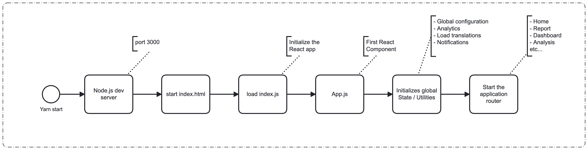
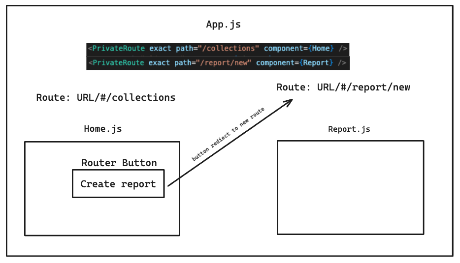

# Front-end application overview

## Table of contents

1. [Overview](#overview)
2. [Application start-up](#application-start-up)
3. [Routing](#routing)
4. [Proxying API requests](#proxying-api-requests)
5. [Project folder structure](#project-folder-structure)
6. [Development scripts](#development-scripts)
7. [Text translations](#text-translations)
8. [Testing](#testing)
   - [Unit tests](#unit-tests)
   - [End-to-end (e2e) tests](#end-to-end-e2e-tests)
9. [Current migrations](#current-migrations)
   - [Typescript](#typescript)
   - [Carbon UI](#carbon-ui)
   - [Class to functional React components](#class-to-functional-react-components)
   - [Higher-order component to hooks](#higher-order-component-to-hooks)

## Overview

This document provides an overview of the front-end application. It explains how the app starts, manages routing, handles API request proxying in development, and translates text to the browser's language. Additionally, it describes the current ongoing migration initiatives.

## Application start-up

The front-end application was initially created using the `create-react-app` CLI and has been upgraded to use Vite. The following steps are executed when the application is started:

1. **Application startup**: The application is started using the command `yarn start`. This command utilizes Vite to spin up a development server, which serves the `index.html` file efficiently.
2. **Initializing React app**: The HTML file loads the JavaScript required for the React.js application. The main entry point is the `src/index.js` file, which then loads all the other modules.
3. **Main React component**: The `src/App.js` file is then loaded as the main React.js component.
4. **Utilities and router initialization**: The `App.js` component initializes various utilities (such as notifications, analytics, translations, and onboarding) and sets up routing for different pages (Home, Report, Dashboard, Analysis, EventsBasedProcess, etc.)

Below is a flow diagram of the start-up process:



## Routing

Routing in the application is managed by `App.js`. We use a hash-based router, which parses everything after the hash sign in the URL to determine the page component to render. Here's an example of how it works:

- When the application is accessed at the URL (`/#/collections`), the `Home.js` page is loaded.
- When the application is accessed at `/#/report/new`, the `Report.js` component is loaded.

Below is a simplified visual representation of the routing setup:



## Proxying API requests

To handle API requests in development, we use a proxy setup to forward requests from the front-end server (running on `localhost:3000`) to the backend server (running on `localhost:8090`). Here is an example of how this works:

1. When the `Home.js` component loads entities by calling `loadEntities()`, it makes a request to `/api/entities`.
2. The request made to `/api/entities` by the front-end is forwarded to `localhost:8090/api/entities` on the backend server, which returns the list of entities to the front-end.

## Project folder structure

Below is an overview of the `src` folder structure and the purpose of each major directory and file.

### Root directory

The root `src` directory contains the main entry points and configuration files for the project. Below are the key files:

- **App.js**: The main application component.
- **index.js**: Entry point of the application.
- **vite.config.js**: Vite configuration file with proxy configuration for the development server.
- **setupTests.ts**: Setup file for tests.
- **style.scss**: Global styles for the application.

### Components

The `components` directory is where the main routes and page components of the application exist. Additionally, it contains the **PrivateRoute** component, which contains the logic for handling protected routes.

### Modules

The `modules` directory contains everything that is reused across routes and components, from services to global utilities. This directory includes:

- **components**: Reusable components.
- **HOC**: Reusable higher-order components.
- **hooks**: Custom reusable React hooks.
- **services**: Global services for API calls, formatting, and other functionalities.
- **shared-styles**: Shared styles and SCSS files.
- **tracking**: Components and services for Mixpanel tracking.
- **translation**: Components and utilities for handling translations. This is explained in detail below.
- **request.ts**: Utility for handling requests.
- **types.ts**: Global TypeScript type definitions.
- **config.tsx**: Global UI configuration.

Note: Everything in this directory can be imported directly by referencing the directory name (for example, `import { x } from 'components'`) because of the `wireModules` script that we will explain later in this document.

## Development scripts

The development scripts exist inside the `scripts` folder. Here is a brief explanation of the scripts we developed:

- **e2e**: This script sets up and executes end-to-end (E2E) tests on the CI using TestCafe. It runs the tests on three browsers in parallel to execute the tests on BrowserStack.
- **start-backend**: This script starts everything needed for development apart from the front-end application. It starts the `docker-compose.yml` to start necessary services, and starts the backend server. It can be triggered using the `yarn start-backend` command.
- **writeModules**: This script runs on the `package.json` "postinstall" hook. It is used to create a symbolic link of the `modules` folder into the `node_modules` folder. This makes it easier to import stuff from the modules folder (reusable component & services module) without the need to specify the full path.

  For example, if we need to use the request module that exists inside `src/modules/request.ts`, we can do the following: `import {...} from 'request'` anywhere in the codebase.

## Text translations

Our application supports multiple languages through a text translation module we developed. All translations are maintained in JSON files, such as `en.json` for English and `de.json` for German.

### Structure of JSON files

The JSON files group common features and functionality within nested properties. Each property name follows camelCase conventions for consistency and readability. Here is an example:

```json
// en.json
{
  "login": {
    "username": "Username",
    "password": "Password"
  },
  "report": {
    "instanceCount": "There are {count} instances"
  }
}
```

### Loading and resolving translations

We have built a module called `translation.tsx` that is responsible for loading and resolving translations based on the user's browser language. This module handles:

1. **Fetching translations**: When the application loads, it issues a request to the backend to fetch the appropriate JSON translation file.
2. **Loading translations**: The translations are then loaded into the application memory as a global object inside the module.
3. **Resolving translations**: The module resolves the translations dynamically based on the detected browser language, ensuring that users see the application in their preferred language. It has a `t` function that resolves the translation based on the provided path. For example, `t('login.username')` returns `Username`. It is also possible to pass values to the translation. For example, `t('report.instanceCount', {count: 5})` returns `There are 5 instances`.

## Testing

Our front-end application employs a testing strategy that includes both unit tests and end-to-end (E2E) tests.

### Unit tests

Unit tests are conducted using Jest and Enzyme to ensure individual components function as expected. The configuration file for unit tests (`setupTests.ts`) sets up the testing environment, including polyfills, adapters, and global functions to handle promises and garbage collection.

For mocking internal or external modules, we usually use `Jest.mock` function in the test file where the module is being used. In some cases, we require the module to be mocked globally. To do that, we place a mock file or folder of the module inside the `src/__mocks__` folder.

### End-to-end (E2E) tests

End-to-end tests are executed using TestCafe to validate the functionality of the application in a real browser environment. These tests cover user interactions and the integration of various components. Tests are run in three parallel browsers to speed up the process. Different users are configured for each browser to avoid race conditions.

**CSS selectors management**: CSS selectors are organized in separate files named `<ModuleName>.elements.js`. Common selectors used across multiple tests are stored in `Common.elements.js` to avoid duplication.

**Screenshot generation**: E2E tests can generate screenshots for documentation purposes by running `yarn screenshots`. The `e2e/browserMagic.js` module is sometimes used to add labels and arrows to screenshots, enhancing their utility for documentation.

**CI jobs**: We have two workflows on the CI that run the E2E tests:

1. `optimize-e2e-tests-sm.yml`: It runs the E2E tests in self-managed mode on PR/push in a headless version of Firefox.
2. `optimize-e2e-tests-cloud.yml`: It runs the E2E tests in cloud mode on PR/push in a headless version of Chrome.

## Current migrations

### Typescript

In [OPT-6735](https://jira.camunda.com/browse/OPT-6735), we initiated the migration to TypeScript for the Optimize project. Up to this point, the core services, utilities, and a significant portion of the reusable components have been successfully migrated to TypeScript. We migrate the codebase incrementally while we are working on other issues. We usually try to migrate at least one module to TypeScript per issue.

### Carbon UI

In [#6841](https://github.com/camunda/camunda-optimize/issues/6841), we initiated the migration of the Optimize UI to Carbon. Up to this point, most of the UI is already migrated. There are still leftovers (loading states, tooltips, notifications) that we are still working on migrating.

### Class to functional React components

The class-based approach in React is obsolete and should not be used anymore. When we encounter a class-based React component, we try to migrate it to a functional component.

### Higher-order component to hooks

We are currently migrating our codebase from using higher-order components (HOCs) to React Hooks. An HOC is a type of wrapper pattern where an HOC function takes a component and returns a new component with extended functionality. While powerful, HOCs can make the code harder to read and follow, especially when multiple HOCs are combined. React Hooks provide a cleaner way to add state and side effects to functional components and are the recommended approach.

It is advised to avoid using HOCs and use hooks instead (for example, use the useErrorHandling hook instead of the withErrorHandling HOC). However, if you are dealing with a big class and you do not want or have the time to migrate to a functional component, you can still use the HOC in that component.
