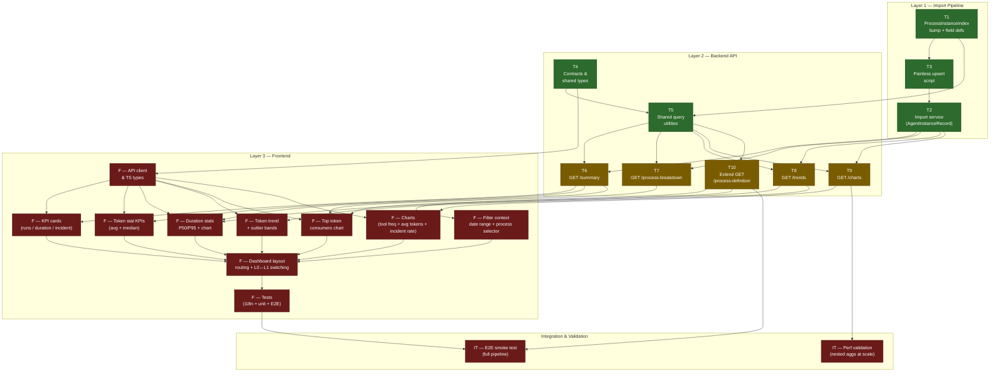

<!--
  Task dependency graph — Agentic Control Plane feature
  Render with any Mermaid-aware viewer (GitHub, IntelliJ, VS Code + Mermaid plugin).
-->



## Legend

| Color  | Meaning                        |
|--------|--------------------------------|
| Green  | Done (Tasks 1–5)               |
| Amber  | Next — blocked on nothing      |
| Red    | Blocked — upstream not done    |

## Critical path

```
T1 → T3 → T2 → T6/T7/T8/T9 → FE charts → FDash → FTests → IT-Smoke
```

Parallel fast track (no L1 dependency):

```
T4 → T5 → T10 → FFilter
```

## Parallelism opportunities

| Can run in parallel            | Shared blocker            |
|-------------------------------|---------------------------|
| T6, T7, T8, T9               | Both need T2 + T5 done    |
| T10, T6–T9                   | All need T5               |
| FKPI, FTokenSt, FDur, FTrend  | All need T6 + FAPI        |
| FCharts (×3 components)       | All need T9 + FAPI        |
| ITPerf (starts at T9 merge)   | Does not need FE          |
