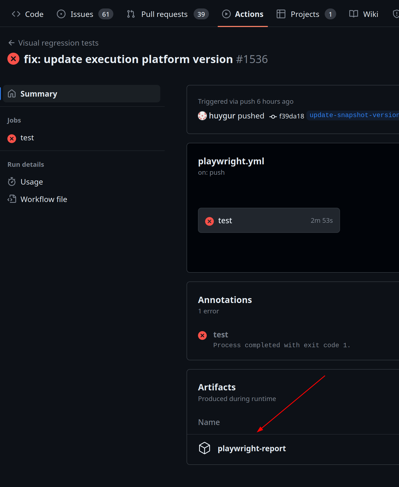

## Tasklist

Tasklist is an graphical and API application to manage user tasks in Zeebe.

## Build and run

> By default, all Makefile commands run against Elasticsearch.
> Passing `DATABASE=opensearch` argument targets OpenSearch.

To build and run the project with all the dependencies, run the below command:

```sh
make env-up
```

The above command will generate docker containers for all the dependencies and make the web application available in http://localhost:8080/.

Additionally, if you want to bring up the environment with the identity, you can use the command:

```sh
make env-identity-up
```

This command will bring up the environment while ensuring the specific identity configuration is applied.

In case you want to clean everything to build again, run the below command:

```sh
make env-down
```

In order to run the application locally for debug purposes, you can start only the Tasklist dependencies using:

```sh
DATABASE=elasticsearch docker compose -f /config/docker-compose.yml up -d zeebe
```

You can export the `DATABASE` variable in your shell for convenience. Similarly, for opensearch:

```sh
DATABASE=opensearch docker compose -f /config/docker-compose.yml up -d zeebe
```

And then start the spring-boot application under webapp folder in your preferred IDE.

#### Docker Compose

The [docker compose file](/config/docker-compose.yml) is built in an incremental way relying on the /env directory configuration files
to provide the relevant environment variables for the services. Targeting a top level service will result in all it's dependencies being created.
There are four configuration bundles:
- Base configurations, no suffix
- *_identity: Identity with plain authentication configuration
- *_oauth: Identity with OAuth configuration
- *_mt: Multitenancy configuration with OAuth and Identity

For example, to start Tasklist with multitenancy configuration:

```sh
DATABASE=elasticsearch docker compose -f /config/docker-compose.yml up -d tasklist_mt
```

This will result in the creation of all dependencies for the multitenancy configuration. (Zeebe, Elasticsearch, Identity, Postgres, Keycloak and finally Tasklist).

Similar to run Zeebe alone for testing purposes, you can run:

```sh
DATABASE=elasticsearch docker compose -f /config/docker-compose.yml up -d zeebe_mt
```

This will result in all the above dependencies being created, except for Tasklist.

### Running visual regression tests

On Tasklist we use Playwright for visual regression testing. These tests run on every push on every branch through Github Actions.

To run these locally you can follow the steps below:

1. Inside the client folder run `npm run build:visual-regression`
2. After the build is finished start the Docker container with `npm run start-visual-regression-docker`
3. Inside the container, run `npm run start:visual-regression &`
4. After that, run `npm run test:visual`

#### Updating screenshots

If you made feature changes and want to purposely wants to update the UI baseline you can follow the steps before, but on step 4 you should run `npm run test:visual --update-snapshots`. Beware the this will update all screenshots, so make sure you only have the changes you want to update in your branch.

#### Inspecting failures in the CI

Sometimes the visual regression tests might fail in the CI and you want to check why. To achieve that you can download the Playwright report assets (like in the image below), unzip the folder and then run `npx @playwright/test show-report folder-with-unzipped-assets/`.



## Backporting changes

Some changes need to be copied to older versions. We use the
[backport](https://github.com/zeebe-io/backport-action) Github Action to automate this process.
Please follow these steps to backport your changes:

1. **Label the pull request** with a backport label (e.g. the label `backport stable/8.3` indicates
   that we want to backport this pull request to the `stable/8.3` branch). It will be automatically
   backported when the pull request is merged.
2. The Github Actions bot comments on the pull request once it finishes:
   - When _successful_, a new backport pull request was automatically created. Simply **approve and
     merge it**
   - If it _failed_, please follow these **manual steps**:
     1. Locally checkout the target branch (e.g. `stable/8.3`).
     2. Make sure it's up to date with origin (i.e. `git pull`).
     3. Checkout a new branch for your backported changes (e.g. `git checkout -b
        backport-123-to-stable/8.3`).
     4. Cherry pick your changes `git cherry-pick -x <sha-1>...<sha-n>`. You may need to resolve
        conflicts.
     5. Push your cherry-picked changes `git push`.
     6. Create a pull request for your backport branch:
        - Make sure it is clear that this backports in the title (e.g. `[Backport stable/8.3] Title
          of the original PR`).
        - Make sure to change the target of the pull request to the correct branch (e.g.
          `stable/8.3`).
        - Refer to the pull request in the description to link it (e.g. `backports #123`)
        - Refer to any issues that were referenced in the original pull request (e.g. `relates to #99`).

