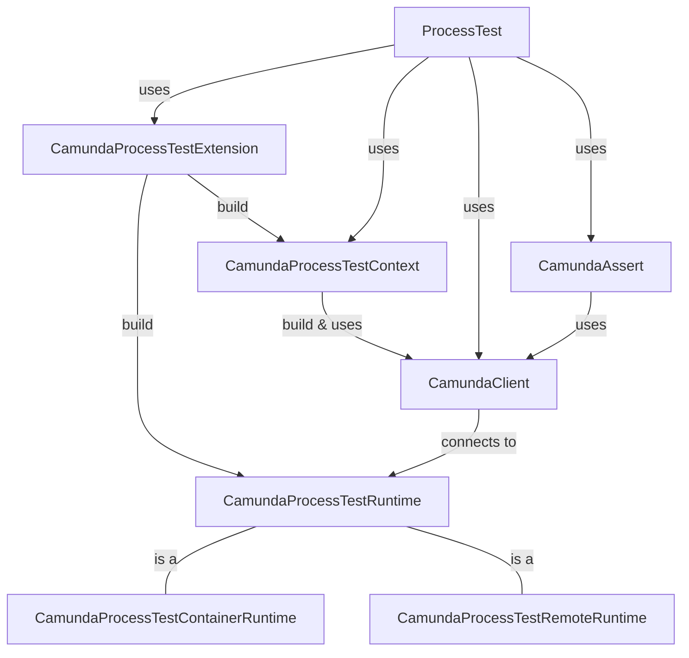

# Contributing to the Camunda Process Test

> [!NOTE]
> Please make sure to read the general [Camunda Contribution Guidelines](../CONTRIBUTING.md) before
> contributing. This document focuses specifically on contributing to the Camunda Process Test (CPT)
> projects.

## Architecture Overview

The following diagram shows an overview of the different components:



- CamundaProcessTestExtension: The JUnit 5 extension builds the runtime and manages the test
  lifecycle.
- CamundaProcessTestContext: The context builds the CamundaClient and provides utilities.
- CamundaAssert: The entry point for all assertions.
- CamundaProcessTestRuntime: The interface for all runtime implementations.
- CamundaProcessTestContainerRuntime: The default runtime based on Testcontainers.
- CamundaProcessTestRemoteRuntime: The runtime connecting to a remote Camunda engine.

The Spring module has a similar architecture, but uses the `CamundaProcessTestExecutionListener`
instead of the JUnit extension.

### Design Principles

* Open for extension: The library is designed to be easily extensible, allowing developers to add
  new features and capabilities as needed.
* Consistent with APIs and SDKs: The library closely follows the design and conventions of the
  Camunda
  API and SDK, ensuring a consistent experience for developers.
* Simplicity: The library is designed to be easy to use and understand, with a focus on simplicity
  and clarity.

### Client Interaction

The assertions and utilities use the `CamundaClient` to send search requests and commands to the
runtime.
The [CamundaDataSource](camunda-process-test-java/src/main/java/io/camunda/process/test/impl/assertions/CamundaDataSource.java)
is a facade over the CamundaClient that provides convenient methods for querying data. Prefer using
the `CamundaDataSource` instead of directly using the `CamundaClient`.

### Awaiting Behavior

The assertions and utilities
use [CamundaAssertAwaitBehavior](camunda-process-test-java/src/main/java/io/camunda/process/test/api/CamundaAssertAwaitBehavior.java)
to wait for something to happen, for example, to assert that a process instance is in a given state.
The default implementation
is [AwaitilityBehavior](camunda-process-test-java/src/main/java/io/camunda/process/test/impl/assertions/util/AwaitilityBehavior.java),
which uses [Awaitility](http://www.awaitility.org/).

For tests, we can
use [DevAwaitBehavior](camunda-process-test-java/src/test/java/io/camunda/process/test/utils/DevAwaitBehavior.java)
to verify assertion messages without waiting for the timeout.

### Test Scenarios DSL

The DSL is defined in the JSON
schema [test-scenario-dsl.schema.json](camunda-process-test-dsl/src/main/resources/schema/test-scenario-dsl.schema.json).
We use [Immutables](https://immutables.github.io/)
and [Jackson](https://github.com/FasterXML/jackson) to deserialize a JSON file into a Java object of
the
type [TestScenario](camunda-process-test-dsl/src/main/java/io/camunda/process/test/api/dsl/TestScenario.java).

We don't generate the Java classes directly from the JSON schema because of limitations in the
existing tools. We manually keep the JSON schema and the Java interfaces in sync. The test
[PojoCompatibilityTest](camunda-process-test-dsl/src/test/java/io/camunda/process/test/dsl/PojoCompatibilityTest.java)
verifies the compatibility between both.

A process test can use
the [TestScenarioRunner](camunda-process-test-java/src/main/java/io/camunda/process/test/api/dsl/TestScenarioRunner.java)
to execute a test scenario.

### Tests

We prefer using unit tests over integration tests where possible. We don't need to test the runtime
or the SDK itself, but rather the logic in the assertions and utilities.

We annotate unit tests with `@CamundaAssertExpectFailure` when we expect an assertion to fail and
want to verify the failure message. This avoids waiting for the timeout in such cases.

We name all integration tests with the `*IT` suffix to distinguish them from unit tests during the
build process.

## Local Development

Make sure to build the project with Maven before running tests for the first time:

```shell
mvn clean build
```

The integration tests require a Docker environment to run the Testcontainers. The runtime chooses
the Docker image versions based on the current Git branch (`main: SNAPSHOT`,
`stable/8.8: 8.8-SNAPSHOT`, etc.).

## CI Pipeline

We run the integration tests in an extra CI job that builds a Camunda Docker image based on the
current branch and uses that image to run the tests.

We select the Docker image using the Maven properties
`io.camunda.process.test.camundaDockerImageName` and
`io.camunda.process.test.camundaDockerImageVersion` in the properties file
`camunda-container-runtime-version.properties`.

## Guide for common contributions

If you're new and want to contribute to the project, check out the following step-by-step guides for
common contributions.

### Adding a new assertion

Example: Add a new assertion method `assertProcessInstance(..).isAwesome(true)`.

- [CamundaAssert](camunda-process-test-java/src/main/java/io/camunda/process/test/api/CamundaAssert.java)
  is the entry point for all assertions. The assertions are grouped by their entities, such as
  process instances and user tasks.
- Add the new assertion method `isAwesome(boolean)` to
  [ProcessInstanceAssert](camunda-process-test-java/src/main/java/io/camunda/process/test/api/assertions/ProcessInstanceAssert.java).
- Implement the assertion method in
  [ProcessInstanceAssertj](camunda-process-test-java/src/main/java/io/camunda/process/test/impl/assertions/ProcessInstanceAssertj.java).
- Add unit tests for the assertion method in
  [ProcessInstanceAssertTest](camunda-process-test-java/src/test/java/io/camunda/process/test/api/ProcessInstanceAssertTest.java)
  , group them in a nested class, and use Mockito to mock the data source.
- Verify the assertion manually in an integration test, for example in
  [CamundaProcessTestExtensionIT](camunda-process-test-java/src/test/java/io/camunda/process/test/api/CamundaProcessTestExtensionIT.java),
  and add it optionally to integration tests or
  the [example project](camunda-process-test-example/src/test/java/io/camunda).
- Add documentation for the new assertion method in the
  [Camunda docs](https://docs.camunda.io/docs/next/apis-tools/testing/assertions/).

### Add a new DSL instruction

Example: Add a new instruction `HAVE_FUN` to the test scenario DSL.

- Add the new instruction `HAVE_FUN` to the JSON schema of the
  DSL [test-scenario-dsl.schema.json](camunda-process-test-dsl/src/main/resources/schema/test-scenario-dsl.schema.json)
  under the `TestCaseInstruction`
  definition. Define its
  required and optional properties. Add descriptions for the instruction and its properties.
- Add the new Java interface `HaveFunInstruction` that extends
  [TestCaseInstruction](camunda-process-test-dsl/src/main/java/io/camunda/process/test/api/dsl/TestCaseInstruction.java).
  Add getter methods for all properties defined in the JSON schema with their descriptions. Add the
  Immutable's annotation `@Value.Immutable` and the Jackson annotation `@JsonDeserialize` to the
  interface.
- Add the new instruction type `HAVE_FUN`
  to [TestCaseInstructionType](camunda-process-test-dsl/src/main/java/io/camunda/process/test/api/dsl/TestCaseInstructionType.java).
  Add the Jackson sub-type mapping for the new instruction
  to [TestCaseInstruction](camunda-process-test-dsl/src/main/java/io/camunda/process/test/api/dsl/TestCaseInstruction.java).
  Override the `getType()` method in the interface `HaveFunInstruction` to return the type
  `HAVE_FUN`.
- Extend
  the [PojoCompatibilityTest](camunda-process-test-dsl/src/test/java/io/camunda/process/test/dsl/PojoCompatibilityTest.java)
  by adding new arguments for
  the parameterized tests to verify the new instruction `HAVE_FUN`.
- Add the new instruction handler `HaveFunInstructionHandler` that implements
  [TestCaseInstructionHandler](camunda-process-test-java/src/main/java/io/camunda/process/test/impl/dsl/TestCaseInstructionHandler.java).
  Use the client, the context, or the assertions to execute the instruction behavior.
- Register the new instruction handler in
  [CamundaTestScenarioRunner](camunda-process-test-java/src/main/java/io/camunda/process/test/impl/dsl/CamundaTestScenarioRunner.java).
- Add unit tests for the new instruction handler.
- Optionally, extend the integration
  test [TestScenarioIT](camunda-process-test-java/src/test/java/io/camunda/process/test/api/TestScenarioIT.java)
  by adding the new instruction in a test scenario DSL file.

## FAQ

### The integration tests are failing locally but work in CI

Most likely, your Docker images are out of date. The CI runs the tests with a Docker image from the
current code base.

You can update your Docker images, for example, using the following commands:

```shell
docker pull camunda/camunda:SNAPSHOT

docker pull camunda/connectors-bundle:SNAPSHOT
```

### The process test coverage HTML report is empty/broken

The HTML report requires generated code
from [camunda-process-test-coverage-frontend](camunda-process-test-coverage-frontend). Maven
generates the code during the `generate-sources` phase, unless you disabled it via the profile
`skipFrontendBuild` or the property `skip.fe.build`.

Make sure to run the Maven build without the profile or property.
