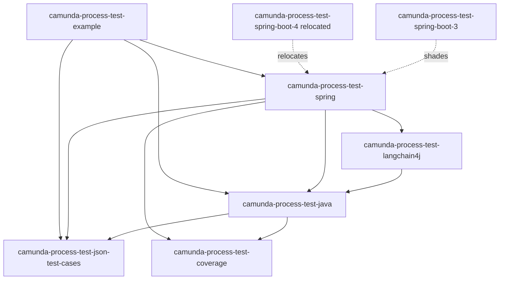
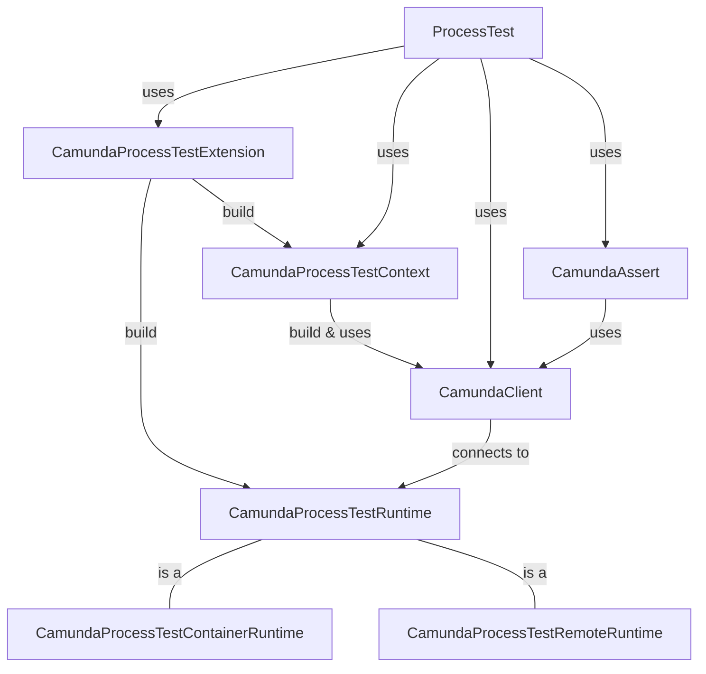

# Contributing to Camunda Process Test (CPT)

**Owner:** `@camunda/c8-testing` · **Docs:** https://docs.camunda.io/docs/apis-tools/testing/getting-started/

---

## 1. Modules

The `testing/` parent (`pom.xml`, `artifactId: camunda-testing`, packaging `pom`) aggregates the
following modules. Only the modules listed in `testing/pom.xml` are part of the build — untracked
work-in-progress folders in your local checkout are not.

|                   Module                   |    Packaging     |                                                                                                                             Purpose                                                                                                                              |
|--------------------------------------------|------------------|------------------------------------------------------------------------------------------------------------------------------------------------------------------------------------------------------------------------------------------------------------------|
| **`camunda-process-test-java`**            | jar              | Core library: JUnit 5 extension, runtime management, assertions, utilities, AI assertions, JSON test-case runner. The heart of CPT.                                                                                                                              |
| **`camunda-process-test-json-test-cases`** | jar              | JSON test-case model (schema + Immutables/Jackson POJOs). No runtime logic — pure data model.                                                                                                                                                                    |
| **`camunda-process-test-coverage`**        | jar              | Process coverage: Java backend (report generation) **and** a webpack-bundled frontend (BPMN visualisation) packaged into the JAR. Has its own [README](camunda-process-test-coverage/README.md) / [CONTRIBUTING](camunda-process-test-coverage/CONTRIBUTING.md). |
| **`camunda-process-test-langchain4j`**     | jar              | LangChain4j bridge providing `ChatModelAdapter` (LLM-as-a-judge) and `EmbeddingModelAdapter` (semantic similarity) implementations, discovered via `ServiceLoader` SPI.                                                                                          |
| **`camunda-process-test-spring`**          | jar              | Canonical Spring integration (Spring 6 / Spring Boot 4, Java 17). Uses `CamundaProcessTestExecutionListener` instead of the JUnit extension.                                                                                                                     |
| **`camunda-process-test-spring-boot-3`**   | jar              | Repackages `camunda-process-test-spring` (shaded) built against Spring Boot 3.5.x. Has no own sources.                                                                                                                                                           |
| **`camunda-process-test-spring-boot-4`**   | pom (relocation) | Empty relocation stub → `camunda-process-test-spring`. Migration path for 8.7/8.8 users of the old artifact.                                                                                                                                                     |
| **`camunda-process-test-example`**         | jar              | Example project for demos and documentation snippets. Also used to generate a real coverage report for local previewing.                                                                                                                                         |

### Dependency graph


```mermaid
flowchart TD
    json[camunda-process-test-json-test-cases]
    coverage[camunda-process-test-coverage]
    java[camunda-process-test-java]
    lc4j[camunda-process-test-langchain4j]
    spring[camunda-process-test-spring]
    sb3[camunda-process-test-spring-boot-3]
    sb4[camunda-process-test-spring-boot-4 relocated]
    example[camunda-process-test-example]

    java --> json
    java --> coverage
    lc4j --> java
    spring --> java
    spring --> json
    spring --> coverage
    spring --> lc4j
    sb3 -.shades.-> spring
    sb4 -.relocates.-> spring
    example --> java
    example --> spring
    example --> json
```

**Rules of thumb**

- `camunda-process-test-java` depends on `json-test-cases` and `coverage`, but **not** on
  `langchain4j` (the LangChain4j bridge is an optional add-on the user pulls in).
- `camunda-process-test-spring` is the single source of truth for Spring support; `spring-boot-3`
  and `spring-boot-4` exist only for packaging/compatibility. Add Spring features to
  `camunda-process-test-spring`.
- Keep `json-test-cases` free of runtime logic — it is a shared model consumed by the runner in
  `camunda-process-test-java`.

---

## 2. Architecture (`camunda-process-test-java`)


```mermaid
flowchart TD
    ProcessTest
    CamundaProcessTestExtension
    CamundaProcessTestContext
    CamundaClient
    CamundaAssert
    CamundaProcessTestRuntime
    CamundaProcessTestContainerRuntime
    CamundaProcessTestRemoteRuntime

    ProcessTest --> |uses| CamundaProcessTestExtension
    ProcessTest --> |uses| CamundaProcessTestContext
    ProcessTest --> |uses| CamundaClient
    ProcessTest --> |uses| CamundaAssert
    CamundaProcessTestExtension --> |build| CamundaProcessTestRuntime
    CamundaProcessTestExtension --> |build| CamundaProcessTestContext
    CamundaProcessTestContext --> |build & uses| CamundaClient
    CamundaAssert --> |uses| CamundaClient
    CamundaClient --> |connects to| CamundaProcessTestRuntime
    CamundaProcessTestRuntime --- |is a| CamundaProcessTestContainerRuntime
    CamundaProcessTestRuntime --- |is a| CamundaProcessTestRemoteRuntime

    click CamundaProcessTestExtension "https://github.com/camunda/camunda/blob/main/testing/camunda-process-test-java/src/main/java/io/camunda/process/test/api/CamundaProcessTestExtension.java" _blank;
    click CamundaProcessTestContext "https://github.com/camunda/camunda/blob/main/testing/camunda-process-test-java/src/main/java/io/camunda/process/test/api/CamundaProcessTestContext.java" _blank;
    click CamundaAssert "https://github.com/camunda/camunda/blob/main/testing/camunda-process-test-java/src/main/java/io/camunda/process/test/api/CamundaAssert.java" _blank;
    click CamundaProcessTestRuntime "https://github.com/camunda/camunda/blob/main/testing/camunda-process-test-java/src/main/java/io/camunda/process/test/impl/runtime/CamundaProcessTestRuntime.java" _blank;
    click CamundaProcessTestContainerRuntime "https://github.com/camunda/camunda/blob/main/testing/camunda-process-test-java/src/main/java/io/camunda/process/test/impl/runtime/CamundaProcessTestContainerRuntime.java" _blank;
    click CamundaProcessTestRemoteRuntime "https://github.com/camunda/camunda/blob/main/testing/camunda-process-test-java/src/main/java/io/camunda/process/test/impl/runtime/CamundaProcessTestRemoteRuntime.java" _blank;
```

**Public API** lives in `io.camunda.process.test.api`; implementation details in
`io.camunda.process.test.impl`. Keep the split — never expose `impl` types through the public API.

|                                                             Public entry point                                                             |                                                                           Role                                                                            |
|--------------------------------------------------------------------------------------------------------------------------------------------|-----------------------------------------------------------------------------------------------------------------------------------------------------------|
| [`@CamundaProcessTest`](camunda-process-test-java/src/main/java/io/camunda/process/test/api/CamundaProcessTest.java)                       | Meta-annotation that registers the extension.                                                                                                             |
| [`CamundaProcessTestExtension`](camunda-process-test-java/src/main/java/io/camunda/process/test/api/CamundaProcessTestExtension.java)      | JUnit 5 extension: builds the runtime, manages the test lifecycle.                                                                                        |
| [`CamundaProcessTestContext`](camunda-process-test-java/src/main/java/io/camunda/process/test/api/CamundaProcessTestContext.java)          | Builds the `CamundaClient` and exposes utilities (clock control, time travel, mocks).                                                                     |
| [`CamundaAssert`](camunda-process-test-java/src/main/java/io/camunda/process/test/api/CamundaAssert.java)                                  | Entry point for all assertions, grouped by entity (process instance, user task, …).                                                                       |
| [`CamundaProcessTestRuntime`](camunda-process-test-java/src/main/java/io/camunda/process/test/impl/runtime/CamundaProcessTestRuntime.java) | Runtime interface. Implementations: `CamundaProcessTestContainerRuntime` (default, Testcontainers) and `CamundaProcessTestRemoteRuntime` (remote engine). |

Spring uses the same core but swaps the JUnit extension for
[`CamundaProcessTestExecutionListener`](camunda-process-test-spring/src/main/java/io/camunda/process/test/api/CamundaProcessTestExecutionListener.java)
(annotation `@CamundaSpringProcessTest`).

### Design principles

- **Open for extension** — easy to add new assertions, instructions, and model providers.
- **Consistent with the Camunda API & SDK** — mirror the conventions of the `CamundaClient`.
- **Simplicity (KISS / YAGNI)** — keep the API small and obvious; don't overengineer.

### Key design choices

- **Client interaction** — assertions and utilities talk to the runtime through the `CamundaClient`.
  Prefer the
  [`CamundaDataSource`](camunda-process-test-java/src/main/java/io/camunda/process/test/impl/assertions/CamundaDataSource.java)
  facade over the raw client when querying data.
- **Awaiting behavior** — assertions wait via
  [`CamundaAssertAwaitBehavior`](camunda-process-test-java/src/main/java/io/camunda/process/test/api/CamundaAssertAwaitBehavior.java);
  the default
  [`AwaitilityBehavior`](camunda-process-test-java/src/main/java/io/camunda/process/test/impl/assertions/util/AwaitilityBehavior.java)
  uses [Awaitility](http://www.awaitility.org/). Tests can use
  [`DevAwaitBehavior`](camunda-process-test-java/src/test/java/io/camunda/process/test/utils/DevAwaitBehavior.java)
  to verify assertion messages without waiting for the timeout.
- **AI assertions** — two optional features, defined by SPIs in `camunda-process-test-java` and
  implemented in `camunda-process-test-langchain4j`:
  - **Judge (LLM-as-a-judge)** — `io.camunda.process.test.api.judge` (`ChatModelAdapter`,
    `ChatModelAdapterProvider`). Used by `satisfiesJudge(...)` assertions.
  - **Semantic similarity** — `io.camunda.process.test.api.similarity` (`EmbeddingModelAdapter`,
    `EmbeddingModelAdapterProvider`).
    Providers are discovered via `ServiceLoader` from
    `META-INF/services/...` files in the LangChain4j module. Supported providers: OpenAI, Azure
    OpenAI, Anthropic, Amazon Bedrock, and OpenAI-compatible endpoints.
- **Mocks** — `io.camunda.process.test.api.mock` (e.g. `JobWorkerMockBuilder`) lets tests stub job
  workers.
- **JSON test cases** — see below.

### JSON test cases

- The format is defined in the
  [JSON schema](camunda-process-test-json-test-cases/src/main/resources/schema/cpt-test-cases/schema.json)
  (current `$id` version `8.10`).
- We use [Immutables](https://immutables.github.io/) and
  [Jackson](https://github.com/FasterXML/jackson) to deserialize a JSON file into a
  [`TestCases`](camunda-process-test-json-test-cases/src/main/java/io/camunda/process/test/api/testCases/TestCases.java)
  object.
- Java classes are **not** generated from the schema (tooling limitations). We keep the schema and
  the interfaces in sync **manually**;
  [`PojoCompatibilityTest`](camunda-process-test-json-test-cases/src/test/java/io/camunda/process/test/testCases/PojoCompatibilityTest.java)
  verifies compatibility.
- A process test runs a JSON test case via
  [`TestCaseRunner`](camunda-process-test-java/src/main/java/io/camunda/process/test/api/testCases/TestCaseRunner.java).

### Coverage

The coverage module combines a **Java backend** (report generation, `io.camunda.process.test.*.coverage`)
with a **webpack-bundled frontend** (BPMN visualisation using `camunda-bpmn-js`). Maven runs webpack
via `frontend-maven-plugin` during `generate-sources`, and the resulting `coverage/index.html` +
`coverage/static/…` are packaged into the JAR and read from the classpath by `CoverageReportUtil`.
See the module's [README](camunda-process-test-coverage/README.md) and
[CONTRIBUTING](camunda-process-test-coverage/CONTRIBUTING.md) before touching it.

---

## 3. Configuration

CPT is configured differently depending on the module. The **runtime mode** is the central setting
in both:

|        Mode         |                                      Meaning                                       |
|---------------------|------------------------------------------------------------------------------------|
| `MANAGED` (default) | CPT starts a Camunda runtime (Testcontainers) per test class.                      |
| `SHARED`            | CPT starts one managed runtime shared by all test classes (faster, shared config). |
| `REMOTE`            | CPT connects to an externally managed Camunda runtime — nothing is started.        |

Defaults live in
[`CamundaProcessTestRuntimeDefaults`](camunda-process-test-java/src/main/java/io/camunda/process/test/impl/runtime/CamundaProcessTestRuntimeDefaults.java).

### Java (`camunda-process-test-java`)

Configuration comes from two sources, applied in this order:

1. **Properties file** — an optional `camunda-container-runtime.properties` on the test classpath
   (e.g. `src/test/resources/`). It overrides the built-in
   `camunda-container-runtime-version.properties` (which carries the default image versions). Loaded
   by
   [`ContainerRuntimePropertiesUtil`](camunda-process-test-java/src/main/java/io/camunda/process/test/impl/runtime/ContainerRuntimePropertiesUtil.java).
2. **Programmatic** — fluent `withX(...)` methods on
   [`CamundaProcessTestExtension`](camunda-process-test-java/src/main/java/io/camunda/process/test/api/CamundaProcessTestExtension.java)
   when the extension is registered manually (`@RegisterExtension`). These take precedence over the
   file.

Key property names (see the `*Properties` classes in
`io.camunda.process.test.impl.runtime.properties`):

|                                                  Property                                                  |                          Purpose                          |
|------------------------------------------------------------------------------------------------------------|-----------------------------------------------------------|
| `runtimeMode`                                                                                              | `MANAGED` / `SHARED` / `REMOTE`.                          |
| `elasticsearch.version`, `multiTenancyEnabled`                                                             | Runtime toggles.                                          |
| `remote.client.grpcAddress`, `remote.client.restAddress`                                                   | Client endpoints for `REMOTE` mode.                       |
| `remote.camundaMonitoringApiAddress`, `remote.connectorsRestApiAddress`, `remote.runtimeConnectionTimeout` | Remote runtime endpoints/timeout.                         |
| `assertion.timeout`, `assertion.interval`                                                                  | Awaitility tuning for assertions.                         |
| `coverage.reportDirectory`, `coverage.excludedProcesses`, `coverage.excludedDecisions`                     | Coverage report output.                                   |
| `judge.chatModel.provider`, `judge.threshold`, …                                                           | LLM-as-a-judge (see `JudgeProperties`).                   |
| `similarity.embeddingModel.provider`, `similarity.threshold`, …                                            | Semantic similarity (see `SemanticSimilarityProperties`). |

The Docker image name/version are **not** hard-coded in the file — they are resolved from the Maven
properties `io.camunda.process.test.camundaDockerImageName` / `…camundaDockerImageVersion` (and the
connectors equivalents) at build time. This is how CI points the tests at a freshly built image
(see [CI pipeline](#6-ci-pipeline)).

### Spring (`camunda-process-test-spring`)

Configuration is standard Spring Boot configuration properties under the **`camunda.process-test`**
prefix, bound by
[`CamundaProcessTestRuntimeConfiguration`](camunda-process-test-spring/src/main/java/io/camunda/process/test/impl/configuration/CamundaProcessTestRuntimeConfiguration.java).
Set them in `application.yaml`/`application.properties` (typically under `src/test/resources`):

```yaml
camunda:
  process-test:
    runtime-mode: MANAGED           # MANAGED | SHARED | REMOTE
    camunda-docker-image-version: SNAPSHOT
    connectors-enabled: false
    multi-tenancy-enabled: false
    remote:                         # used when runtime-mode: REMOTE
      client:
        grpc-address: http://localhost:26500
        rest-address: http://localhost:8080
    coverage:
      report-directory: target/coverage-report
    judge: { ... }                  # LLM-as-a-judge config
    similarity: { ... }             # semantic similarity config
    assertion: { ... }              # assertion timeout/interval
```

The nested `remote`, `coverage`, `judge`, `assertion`, and `similarity` blocks map to the
`*Configuration` classes in `io.camunda.process.test.impl.configuration`. In `REMOTE` mode the
Camunda client is configured under `camunda.process-test.remote.client.*`, which binds a standard
`CamundaClientProperties` (auth, gRPC/REST addresses, etc.).

> [!NOTE]
> For AI assertions, `camunda-process-test-langchain4j` reads the same `judge.*` / `similarity.*`
> keys — from the properties file in the Java module, and from `camunda.process-test.judge` /
> `…​.similarity` application properties in Spring. See the
> [langchain4j README](camunda-process-test-langchain4j/README.md) for provider-specific keys.

---

## 4. Testing conventions

- Prefer **unit tests over integration tests**. We don't test the runtime or the SDK itself — test
  the logic in the assertions, utilities, and instruction handlers.
- Annotate a unit test with `@CamundaAssertExpectFailure` when you expect an assertion to fail and
  want to verify its message — this avoids waiting for the timeout.
- Name integration tests with the `*IT` suffix so the build can distinguish them from unit tests.
- Follow the repo-wide conventions: `should…` method names, `// given / // when / // then`, AssertJ,
  Awaitility (never `Thread.sleep`), and unique per-test IDs to avoid flakiness.

---

## 5. Local development

Build the testing modules (and their dependencies) with the Maven wrapper from the repo root — scope
to the module you are working on rather than building the whole repo:

```bash
# Build the core module and its dependencies
./mvnw install -pl testing/camunda-process-test-java -am -Dquickly -T1C

# Run a single unit test class (skips ITs)
./mvnw verify -pl testing/camunda-process-test-java -Dtest=<TestClassName> -DskipTests=false -DskipITs -Dquickly

# Run a single integration test class (skips UTs)
./mvnw verify -pl testing/camunda-process-test-java -Dit.test=<ITClassName> -DskipTests=false -DskipUTs -Dquickly
```

Integration tests require a **Docker environment** (Testcontainers). By default the container runtime
uses the image versions configured in
[`CamundaProcessTestRuntimeDefaults`](camunda-process-test-java/src/main/java/io/camunda/process/test/impl/runtime/CamundaProcessTestRuntimeDefaults.java)
(`SNAPSHOT` on `main`).

Before committing (mandatory — skipping formatting breaks the `Java checks` CI job):

```bash
./mvnw license:format spotless:apply -T1C
./mvnw verify -pl testing/camunda-process-test-java -DskipTests=false -Dquickly
```

For the coverage **frontend**, see [its CONTRIBUTING guide](camunda-process-test-coverage/CONTRIBUTING.md)
(`npm install`, `npm run build`, `npm run dev`).

---

## 6. CI pipeline

- **Unit tests** run as part of the standard `ci.yml` unit-test matrix.
- **Integration tests** run in the `qa-camunda-process-test` group of `ci.yml` (name *"Camunda
  Process"*, owner `@camunda/c8-testing`), covering
  `testing/camunda-process-test-java`, `testing/camunda-process-test-spring`, and
  `testing/camunda-process-test-example`. This job **builds a Camunda Docker image from the current
  code** and runs the ITs against it.
- The image is selected via the Maven properties
  `io.camunda.process.test.camundaDockerImageName` /
  `io.camunda.process.test.camundaDockerImageVersion`, wired through
  [`camunda-container-runtime-version.properties`](camunda-process-test-java/src/main/resources/camunda-container-runtime-version.properties).

### Compatibility tests

We run CPT compatibility tests to ensure forward-compatibility between Camunda runtime images and
CPT:

- Main workflow: `.github/workflows/camunda-process-test-compatibility.yml`
- Daily trigger: `.github/workflows/camunda-process-test-compatibility-trigger.yml`

Parameters: `branch` (e.g. `stable/8.8`), `camunda_image_version` (e.g. `8.9-SNAPSHOT`),
`connectors_image_version` (e.g. `8.9-SNAPSHOT`). The trigger workflow runs daily for the stable
branches and reports failures to Slack.

---

## 7. Release management

After releasing a new minor version of CPT, apply the following:

### Update the default Docker image versions

On the new stable branch, update `DEFAULT_CAMUNDA_DOCKER_IMAGE_VERSION` and
`DEFAULT_CONNECTORS_DOCKER_IMAGE_VERSION` in
[`CamundaProcessTestRuntimeDefaults`](camunda-process-test-java/src/main/java/io/camunda/process/test/impl/runtime/CamundaProcessTestRuntimeDefaults.java)
to match the released minor version (e.g. `8.9-SNAPSHOT` for the `8.9.0` release).

### Add a compatibility-test entry

In `.github/workflows/camunda-process-test-compatibility-trigger.yml`, add a `matrix` entry for the
released minor. For example, for `8.9.0`:

```yaml
- branch: stable/8.9
  camunda_image_version: 8.10-SNAPSHOT
  connectors_image_version: 8.10-SNAPSHOT
```

### Publish the JSON schema

The schema is published per minor at
`https://camunda.com/json-schema/cpt-test-cases/MAJOR_MINOR/schema.json`. Ask the Web Marketing team
via Slack `#ask-web-marketing` to publish the new version (provide the GitHub link to the schema file
and the target URL). On `main`, bump the `$id` in
[`schema.json`](camunda-process-test-json-test-cases/src/main/resources/schema/cpt-test-cases/schema.json)
to the next minor (e.g. `.../8.10/schema.json` when releasing `8.9.0`).

---

## 8. Common contributions (how-to)

### Add a new assertion

Example: `assertThatProcessInstance(..).isAwesome(true)`.

1. `CamundaAssert` is the entry point — assertions are grouped by entity.
2. Add the method to the relevant interface, e.g.
   [`ProcessInstanceAssert`](camunda-process-test-java/src/main/java/io/camunda/process/test/api/assertions/ProcessInstanceAssert.java).
3. Implement it in
   [`ProcessInstanceAssertj`](camunda-process-test-java/src/main/java/io/camunda/process/test/impl/assertions/ProcessInstanceAssertj.java).
4. Add unit tests in
   [`ProcessInstanceAssertTest`](camunda-process-test-java/src/test/java/io/camunda/process/test/api/ProcessInstanceAssertTest.java),
   grouped in a nested class, mocking the data source with Mockito.
5. Optionally verify it in an integration test (e.g.
   [`CamundaProcessTestExtensionIT`](camunda-process-test-java/src/test/java/io/camunda/process/test/api/CamundaProcessTestExtensionIT.java))
   and/or the [example project](camunda-process-test-example/src/test/java/io/camunda).
6. Document it in the [Camunda docs](https://docs.camunda.io/docs/next/apis-tools/testing/assertions/).

### Add a new JSON test-case instruction

Example: add a `HAVE_FUN` instruction.

1. Add it to the
   [JSON schema](camunda-process-test-json-test-cases/src/main/resources/schema/cpt-test-cases/schema.json)
   under `TestCaseInstruction`, with required/optional properties and descriptions.
2. Add a Java interface `HaveFunInstruction extends`
   [`TestCaseInstruction`](camunda-process-test-json-test-cases/src/main/java/io/camunda/process/test/api/testCases/TestCaseInstruction.java)
   with getters matching the schema, annotated `@Value.Immutable` and `@JsonDeserialize`.
3. Add the type to
   [`TestCaseInstructionType`](camunda-process-test-json-test-cases/src/main/java/io/camunda/process/test/api/testCases/TestCaseInstructionType.java),
   register the Jackson sub-type on `TestCaseInstruction`, and override `getType()` in the interface.
4. Extend
   [`PojoCompatibilityTest`](camunda-process-test-json-test-cases/src/test/java/io/camunda/process/test/testCases/PojoCompatibilityTest.java)
   with parameterized arguments for the new instruction.
5. Add a handler `HaveFunInstructionHandler implements`
   [`TestCaseInstructionHandler`](camunda-process-test-java/src/main/java/io/camunda/process/test/impl/testCases/TestCaseInstructionHandler.java)
   and register it in
   [`CamundaTestCaseRunner`](camunda-process-test-java/src/main/java/io/camunda/process/test/impl/testCases/CamundaTestCaseRunner.java).
6. Add unit tests for the handler; optionally extend
   [`TestCasesIT`](camunda-process-test-java/src/test/java/io/camunda/process/test/api/TestCasesIT.java)
   with a JSON test-case file.

### Add a new AI model provider

Example: support a new chat-model provider for LLM-as-a-judge.

1. Add a builder + `ChatModelAdapterProvider` implementation under
   `camunda-process-test-langchain4j` (`io.camunda.process.test.impl.judge`), mirroring the existing
   OpenAI/Anthropic/Bedrock providers.
2. Register the provider class in
   `camunda-process-test-langchain4j/src/main/resources/META-INF/services/io.camunda.process.test.api.judge.ChatModelAdapterProvider`.
3. For semantic similarity, do the same under `io.camunda.process.test.impl.similarity` and register
   in the `...similarity.EmbeddingModelAdapterProvider` service file.
4. Add unit tests and document the provider config keys (see the module
   [README](camunda-process-test-langchain4j/README.md)).

---

## 9. FAQ

### The integration tests fail locally but pass in CI

Your Docker images are probably out of date — CI builds an image from the current code. Refresh them:

```bash
docker pull camunda/camunda:SNAPSHOT
docker pull camunda/connectors-bundle:SNAPSHOT
```

### The process test coverage HTML report is empty/broken

The report needs the frontend generated by
[`camunda-process-test-coverage`](camunda-process-test-coverage). Maven builds it during
`generate-sources` unless you disabled it via the `skipFrontendBuild` profile or the
`skip.fe.build` property. Build without them:

```bash
./mvnw clean compile -Dskip.fe.build=false -pl testing/camunda-process-test-java
```

### Which Spring artifact should a user depend on?

`camunda-process-test-spring` (Spring Boot 4 / Spring 6). Spring Boot 3.5.x users depend on
`camunda-process-test-spring-boot-3`. `camunda-process-test-spring-boot-4` is a relocation stub kept
only for users migrating from 8.7/8.8 — do not add code there.
