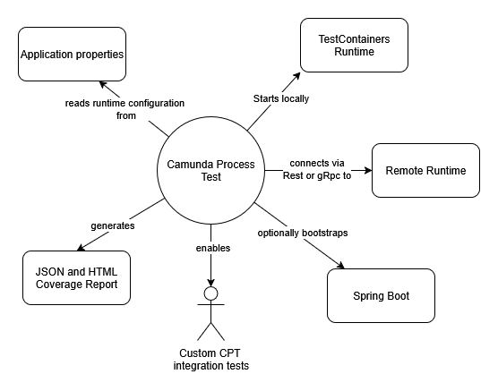
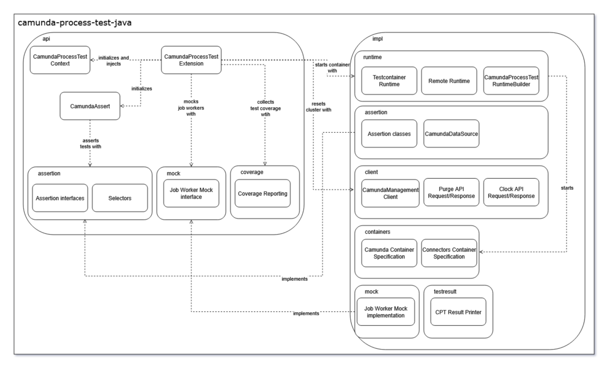
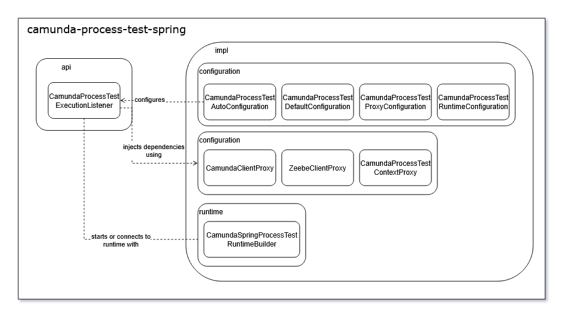
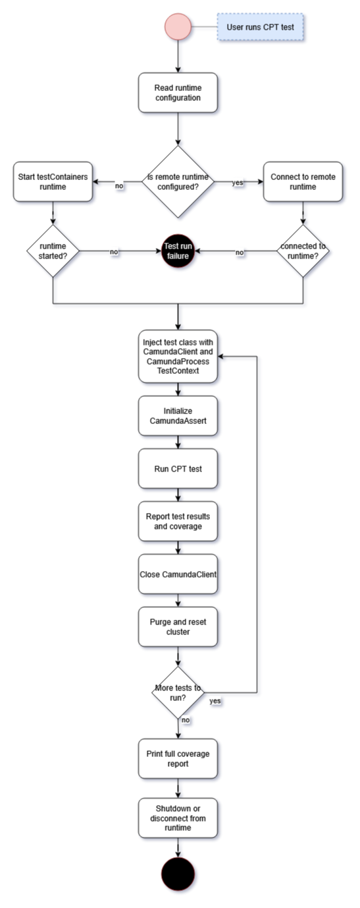
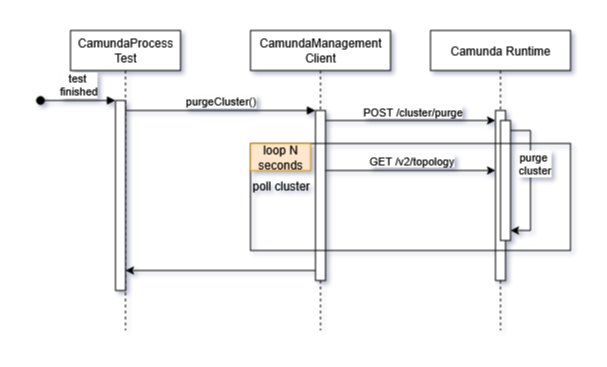

# Contributing to the Camunda Process Test

We welcome new contributions. We take pride in maintaining and encouraging a friendly, welcoming, and collaborative community.

> [!NOTE]
> Before you continue, we ask that you read the [CONTRIBUTING.md](../CONTRIBUTING.md) in the root of this project as that will tell you everything you need
> to know about contributing to the Camunda project in general. Additionally, [the Camunda 8 Testing Docs](https://docs.camunda.io/docs/apis-tools/testing/getting-started/)
> provide a detailed overview of the CPT's configuration and assertion utilities.

## Table of Contents

- [Architecture](#architecture)
  - [System Context](#system-context)
  - [Building Block View](#building-block-view)
  - [CPT Flow](#cpt-flow)
  - [Important CPT Concepts](#important-cpt-concepts)
- [Runtime Configuration](#runtime-configuration)
- [Writing tests](#writing-tests)
  - [Unit Testing Guidelines](#unit-testing-guidelines)
  - [Integration Tests](#integration-tests)
  - [Deploying processes](#deploying-processes)
- [How to Extend CPT](#how-to-extend-cpt)
  - [How to Add a New Assertion Method](#how-to-add-a-new-assertion-method)
  - [How to Add a New Selector](#how-to-add-a-new-selector)
  - [How to Add a New Configuration Property](#how-to-add-a-new-configuration-property)
- [CI Pipeline](#ci-pipeline)
- [FAQ and Common Issues](#faq-and-common-issues)

# Architecture

## System Context



CPT is a test framework for the Camunda Agentic Orchestration platform. It allows you to verify
the behavior of your processes, process elements and decision tables. This is achieved by running
either a self-managed testcontainers runtime locally on your machine or by connecting to a remote
runtime, e.g. a cluster running in the Camunda cloud. Each test is run against the runtime with
detailed error and coverage reporting.

## Building Block View

CPT is split into four modules:

- `camunda-process-test-java` contains the bulk of the code, including the `@CamundaProcessTest` annotation, the assertion selectors, coverage reporting and runtime configuration and setup. For non-spring related stories, you will most likely be maintaining and extending this module.
- `camunda-process-test-spring` contains all spring-related code such as the `CamundaProcessTestExecutionListener` which orchestrates the test setup and execution.
- `camunda-process-test-example` contains examples related to running CPT tests. These should be used in addition to the Camunda 8 documentation mentioned above.
- `camunda-process-test-coverage-frontend` contains the frontend code for the HTML coverage report.

When working on CPT, it's important to keep the Java/Spring split in mind. We do not include any Spring dependencies in the `camunda-process-test-java` project and
all code therein must be made to work without it.

### CPT Java Module Diagram



### CPT Spring Module Diagram



## CPT Flow

Any test annotated with `@CamundaProcessTest` (Java) or `@CamundaSpringProcessTest` (Spring) starts or
connects to a Camunda runtime. From there the framework ensures that a testcontainers runtime, or a
remote runtime, was configured successfully before executing the test and reporting test results and coverage.



## Important CPT Concepts

### Test Lifecycles

Both the `camunda-process-test-java` and `-spring` modules utilize test lifecycle callbacks to perform
additional setup and teardown logic.

In Java, the `CamundaProcessTestExtension` orchestrates the CPT test in the following manner:

- `beforeAll` to initialize the runtime.
- `beforeEach` to inject the CamundaClient and CamundaProcessTestContext into the test class.
- `afterEach` to close the CamundaClients, purge and reset the cluster.
- `afterAll` to close the local runtime (if required) and publish coverage results.

In Spring, it's the `CamundaProcessTestExecutionListener` which relies on Spring's TestExecutionListener's `beforeTestClass`,
`beforeTestMethod`, `afterTestMethod` and `afterTestClass` respectively.

### Awaiting Process Events

The Camunda Process Test must ensure that it has waited an arbitrary amount of time for the process instance
to complete its work and enter an expected state. For example, the test should not fail because the instance
wasn't able to execute a service task or update an element's state quickly enough.

All assertion classes have a custom utility waiting for a process, element or state to be active before
failing an assertion. The `CamundaAssertAwaitBehavior` is the general interface and the default implementation
can be found in `AwaitilityBehavior`:

```java
public void untilAsserted(final ThrowingRunnable assertion) {
  try {
    Awaitility.await()
      .timeout(assertionTimeout) // (1) - Wait for X seconds
      .pollInterval(assertionInterval) // (2) - Retry every X milliseconds. Both assertionTimeout and assertionInterval are set in CamundaAssert
      .ignoreException(ClientException.class)
      .untilAsserted(
        () -> {
          try {
            assertion.run(); // (3) - Try to pass the assertion callback
          } catch (final AssertionError e) {
            // <snip> set error message
            throw e;
          }
        });

  } catch (final ConditionTimeoutException ignore) {
    fail(failureMessage.get()); // (4) - Fail with error message if the assertion hasn't passed after the timeout expired
  }
}
```

An example of how this behavior is used can be found in most assertion classes, e.g. `ProcessInstanceAssertj`:

```java
  private void awaitProcessInstance() {
    awaitBehavior.untilAsserted(
        this::findProcessInstance, // (1) - Query the runtime for running process instances
        processInstance -> { // (2) - The assertion callback, we want to test that a given process instance was found
          processInstance.ifPresent(actualProcessInstance::set);

          assertThat(processInstance)
              .withFailMessage("No process instance [%s] found.", actual.describe())
              .isPresent();
        });
  }
```

You can configure Awaitility's timeout and interval in CamundaAssert using `setAssertionTimeout` and `setAssertionInterval`.
Specifically, when the assertion to be tested is expected to fail, and you add the `@CamundaAssertExpectFailure` annotation, it
switches out the default `AwaitilityBehavior` for `DevAwaitBehavior`. This ensures that the test fails
after the first attempt.

### Cluster Purge



The runtime cluster is purged in between test cases. This is to ensure that the cluster is in a clean state and
(nearly) all runtime data is deleted. This task is performed as part of:

- (Java) `CamundaProcessTestExtension::afterEach`
- (Spring) `CamundaProcessTestExecutionListener::afterTestMethod`

While the cluster is being purged, the brokers are scaled down to zero and the runtime is briefly unavailable.
Additionally, if multi-tenancy is enabled, the user required for basic authentication is also briefly deleted.
Once the cluster is ready to process requests again, the next test case is automatically configured and started.

|  Request Endpoint   | Payload? |            Response            |                                  Effect                                  |
|---------------------|----------|--------------------------------|--------------------------------------------------------------------------|
| POST /cluster/purge | No       | 200                            | Commands the cluster to begin purging runtime data.                      |
| GET /v2/topology    | No       | 200 MinimalTopologyResponseDto | Polls the cluster and waits for it to be healthy (= changeId is updated) |

## Runtime Configuration

[You can find the complete documentation on all of CPT's configuration options here.](https://docs.camunda.io/docs/next/apis-tools/testing/configuration/)

CPT has two `RuntimeMode` options, `MANAGED` (default) and `REMOTE`. The former starts a local testcontainers runtime
while the latter connects to a remote runtime hosted somewhere else, e.g. the Camunda cloud.

### Local testcontainers runtime

The local runtime is configured through the `CamundaContainer` and `ConnectorsContainer` classes found
in `camunda-process-test-java`. Their configuration can be altered through environment variables, the
configuration properties file or by invoking CamundaProcessTestExtension methods.

By default, the Camunda Container has an in-memory H2 database.

### Java Runtime Configuration Properties

Whereas Spring uses the convenient `@ConfigurationProperties` mechanism to detect and inject runtime properties
from an `application.yml` or `application.properties`, it's not quite as simple in a plain Java environment.

In a plain java environment, there are two files from which configuration options are read:

- `camunda-container-runtime-version.properties` contains fixed values set by the Camunda team specifying docker image names and versions.
- `camunda-container-runtime.properties` is a user-specified properties file that overrides the default runtime configuration.

The `ContainerRuntimePropertiesUtil` parses both files, overriding the default runtime configuration. The resulting
configuration, the `CamundaProcessTestRuntimeBuilder`, will then create the appropriate runtime assuming the configuration
is correct. i.e. the credentials for the remote runtime are correct.

# Writing tests

> [!NOTE]
> When possible, prefer unit tests over integration tests. That isn't to say you should avoid integration
> tests, but using IT tests where unit tests would cover the same functionality can lead to a decrease
> in testing performance.

## Unit Testing Guidelines

Unit tests use [Mockito](https://site.mockito.org/) and [JUnit 5](https://docs.junit.org/current/user-guide/).

### Nested Test Classes

When possible, group related test cases in a `@Nested` class:

```java
@ExtendWith({CamundaAssertExtension.class, MockitoExtension.class})
public class ProcessInstanceAssertTest {

  // <snip unrelated code>

  // (1) Nested class grouping tests related to ProcessInstanceSource logic
  @Nested
  class ProcessInstanceSource {

    private static final long ACTIVE_PROCESS_INSTANCE_KEY = 1L;
    private static final long COMPLETED_PROCESS_INSTANCE_KEY = 2L;

    @Mock private ProcessInstanceResult processInstanceResult;
    @Mock private ProcessInstanceFilter processInstanceFilter;
    @Captor private ArgumentCaptor<Consumer<ProcessInstanceFilter>> processInstanceFilterCapture;

    // (2) Specific before and after each logic is executed per nested test class
    @BeforeEach
    void configureMocks() {
      // <snip>
    }

    // (3) Tests related to ProcessInstanceSource
    @Test
    void shouldUseProcessInstanceEvent() {
      // <snip>
    }

    @Test
    void shouldUseDeprecatedProcessInstanceEvent() {
      // <snip>
    }

    @Test
    @CamundaAssertExpectFailure
    void shouldFailWithProcessInstanceEvent() {
      // <snip>
    }

    @Test
    void shouldUseProcessInstanceResult() {
      // <snip>
    }

    @Test
    @CamundaAssertExpectFailure
    void shouldFailWithProcessInstanceResult() {
      // <snip>
    }

    @Test
    void shouldUseByKeySelector() {
      // <snip>
    }
  }
}
```

### Testing expected failures

Because the test's awaitility loop waits for a possible ten seconds before timing out with an error,
we need to annotate methods we expected to fail with `@CamundaAssertExpectFailure`. This instructs
Awaitility to abort on the first condition failure instead of retrying.

```java
// From ProcessInstanceAssertTest
@Test
@CamundaAssertExpectFailure // (1) Declare that the assertion condition is expected to fail
void shouldFailWithByKeySelector() {
  // when
  Assertions.assertThatThrownBy(
          () ->
              CamundaAssert.assertThatProcessInstance(
                      ProcessInstanceSelectors.byKey(COMPLETED_PROCESS_INSTANCE_KEY))
                  .isActive()) // (2) The CamundaAssert will now fail after the first condition failure
      .hasMessage(
          "Process instance [key: %d] should be active but was completed.",
          COMPLETED_PROCESS_INSTANCE_KEY);

  // then
  verify(camundaDataSource).findProcessInstances(any());
}
```

## Integration Tests

### Camunda and Connector Docker Image Versions

When running integration tests, CPT chooses the camunda and connectors runtime docker image based on
the branch you're currently developing on. If it's a stable branch, e.g. `stable/8.8` or a backport
such as `backport-36882-to-stable/8.8`, CPT will choose the docker version `8.8-SNAPSHOT`.
Otherwise, it will default to the latest SNAPSHOT version.

### Java

You can either annotate your integration tests with `@CamundaProcessTest` or register the extension
and configure its expected behavior:

```java
@CamundaProcessTest // (1) - Annotate the integration test
public class ProcessEngineCoverageIT {
  // <snip>
}

// or

public class CamundaProcessTestConnectorsIT {

  @RegisterExtension // (2) - Register the extension and configure its behavior
  private static final CamundaProcessTestExtension EXTENSION =
    new CamundaProcessTestExtension()
      .withConnectorsEnabled(true)
      .withConnectorsSecret(
        "CONNECTORS_URL", "http://connectors:8080/actuator/health/readiness");

  // <snip>
}
```

### Spring

Annotate the test with `@CamundaSpringProcessTest` and use `@SpringBootTest` to provide any custom
configuration your test requires:

```java
@SpringBootTest(
    classes = {CamundaSpringProcessTestConnectorsIT.class},
    properties = {
      "io.camunda.process.test.connectors-enabled=true",
      "io.camunda.process.test.connectors-secrets.CONNECTORS_URL=http://connectors:8080/actuator/health/readiness"
    })
@CamundaSpringProcessTest
public class CamundaSpringProcessTestConnectorsIT {
  // <snip>
}
```

### Deploying processes

You have two options when it comes to deploying processes: you can either create the
process programmatically or you can create a .bpmn file.

#### Creating and Deploying a Process Programmatically

1. Create the BpmnModelInstance
2. Deploy the model
3. Create a new process instance using the process ID

```java
  @Test
  void shouldHandleTruncatedVariables() {
    // (1) - Create the model
    final BpmnModelInstance process =
        Bpmn.createExecutableProcess("process")
            .startEvent()
            .name("start")
            .endEvent()
            .name("end")
            .done();

    // (2) - Deploy the model. Using .join() ensures that the client waits for the command to be completed.
    client.newDeployResourceCommand().addProcessModel(process, "process.bpmn").send().join();

    final Map<String, Object> variables = new HashMap<>();
    variables.put("small", "smallValue");

    // (3) - Create a new process instance using the process ID, in this case "process"
    final ProcessInstanceEvent processInstance =
        client
            .newCreateInstanceCommand()
            .bpmnProcessId("process")
            .latestVersion()
            .variables(variables)
            .send()
            .join();

    CamundaAssert.assertThatProcessInstance(processInstance).isCompleted().hasVariables(variables);
  }
```

#### Using a BPMN file

The same as before, except that you specify a .bpmn from your classpath (`src/test/resources`):

```java
@Test
void shouldInvokeInAndOutboundConnectors() throws IOException {
  // (1) - Searches for a file `connector-process.bpmn` in your resources dir.
  client
      .newDeployResourceCommand()
      .addResourceFromClasspath("connector-process.bpmn")
      .send()
      .join();

  // (2) - Creates a new process instance except the process ID must be specified in the .bpmn file
  final ProcessInstanceEvent processInstance =
    client
      .newCreateInstanceCommand()
      .bpmnProcessId("connector-process")
      .latestVersion()
      .variable("key", "key-1")
      .send()
      .join();
}
```

### Testing expected failures

As with unit tests, annotate test cases where you expect an assertion failure with `@CamundaAssertExpectFailure` to ensure
that the awaitility mechanism fails fast.

# How to Extend CPT

## How to Add a New Assertion Method

1. Identify which part of the process you wish to assert:
   - Assertions related to a process -> `ProcessInstanceAssert`
   - Assertions related to a process element -> `ElementAssertj` and exposed in `ProcessInstanceAssert`
   - Assertions related to a process variable -> `VariableAssertJ` and exposed in `ProcessInstanceAssert`
   - Assertions related to a decision -> `DecisionInstanceAssert`
   - Assertions related to a User Task -> `UserTaskAssert`
2. Add the missing assertion.
3. Add unit tests verifying the assertion's correctness.
4. If the assertion tests new functionality not already covered in an integration test, also add an integration to verify its behavior.
5. Add documentation explaining the assertion's function in the interface.

## How to Add a New Selector

1. Identify which part of the process you wish to implement a new selector for:
   - The process instance -> `ProcessInstanceSelectors`
   - A process element -> `ElementSelectors`
   - A user task -> `UserTaskSelectors`
   - A decision -> `DecisionSelectors`
2. Create an inner class for the new selector:

```java
// From DecisionSelectors
// (1) - Add a new private inner class and implement the corresponding interface
private static final class DecisionIdSelector implements DecisionSelector {

  private final String decisionDefinitionId;
  private final Long processInstanceKey;

  private DecisionIdSelector(final String decisionDefinitionId) {
    this(decisionDefinitionId, null);
  }

  private DecisionIdSelector(final String decisionDefinitionId, final Long processInstanceKey) {
    this.decisionDefinitionId = decisionDefinitionId;
    this.processInstanceKey = processInstanceKey;
  }

  // (2) - It's possible that the initial query returns multiple matches. Your test method
  //       should test each instance to see if it matches the selector's criteria. The first matching
  //       instance is chosen for the assertion.
  @Override
  public boolean test(final DecisionInstance decisionInstance) {
    return decisionDefinitionId.equals(decisionInstance.getDecisionDefinitionId());
  }

  // (3) - Provide a human-readable description of the selector. This is what you'll see as part of
  //       an assertion message when it fails.
  @Override
  public String describe() {
    if (processInstanceKey != null) {
      return String.format(
        "decisionId: %s, processInstanceKey: %d", decisionDefinitionId, processInstanceKey);
    } else {
      return "decisionId: " + decisionDefinitionId;
    }
  }
}
```

3. Expose the new selector with a convenient accessor:

```java
// From DecisionSelectors

/**
 * Select the decision instance by its ID.
 *
 * @param decisionId the definition ID of the decision instance.
 * @return the selector
 */
public static DecisionSelector byId(final String decisionId) {
  return new DecisionIdSelector(decisionId);
}
```

## How to Add a New Configuration Property

Adding a new configuration property must be done in both the -java and -spring project.

### Camunda-Process-Test-Java

1. Add the new property to the `CamundaProcessTestRuntimeBuilder`. If possible, give it a default value.
2. Expose the new property in the `camunda-container-runtime.properties` by adding the property to the relevant `ContainerRuntimePropertiesUtil` configuration object:
   - `CamundaContainerRuntimeProperties` if the property is needed to configure the Camunda testContainer.
   - `ConnectorsContainerRuntimeProperties` if the property is needed to configure the Connectors testContainer.
   - `RemoteRuntimeProperties` if the property is needed to configure the CamundaClient for the remote runtime.
3. Add a new getter method for the new property in the `ContainerRuntimePropertiesUtil`.
4. Expose the new property in `CamundaProcessTestRuntimeDefaults`.
5. Update the implementation of the `CamundaProcessTestRuntimeBuilder` to read the new property from the RuntimeDefaults.
6. Add unit tests verifying the property is correctly set or overwritten.

### Camunda-Process-Test-Spring

1. Add the property to both the `CamundaProcessTestRuntimeConfiguration` and the `LegacyCamundaProcessTestRuntimeConfiguration`.
2. In the `CamundaSpringProcessTestRuntimeBuilder`, set the new property in the runtimeBuilder.
3. Add a unit test verifying the property is correctly set and passed to the runtimeBuilder.

### Using the New Configuration Property

The new property can now be accessed in both the `CamundaProcessTestContainerRuntime` and `CamundaProcessTestRemoteRuntime`. If you want
to update the CamundaClient, you can do so in `RemoteRuntimeClientProperties`:

```java
// (1) - Using a ClientMode other than SaaS is currently not supported.
private CamundaClientBuilder createCamundaClient(final ClientMode mode) {
  return mode == ClientMode.saas ? buildCloudClientFactory() : buildSelfManagedClientFactory();
}

private CamundaClientBuilder buildCloudClientFactory() {
  // (2) - Adjust the CamundaClient's configuration here.
  final CamundaClientCloudBuilderStep5 cloudBuilderStep =
      CamundaClient.newCloudClientBuilder()
          .withClusterId(remoteRuntimeClientCloudProperties.getClusterId())
          .withClientId(remoteRuntimeClientAuthProperties.getClientId())
          .withClientSecret(remoteRuntimeClientAuthProperties.getClientSecret())
          .withRegion(remoteRuntimeClientCloudProperties.getRegion());

  if (remoteRuntimeClientAuthProperties.getMethod() != null) {
    final CredentialsProvider credentialsProvider =
        CptCredentialsProviderConfigurer.configure(this);
    cloudBuilderStep.credentialsProvider(credentialsProvider);
  }

  return cloudBuilderStep;
}

private CamundaClientBuilder buildSelfManagedClientFactory() {
  return CamundaClient.newClientBuilder().usePlaintext();
}
```

# CI Pipeline

The CI Pipeline builds a camunda test environment using the dockerImageNames and -Versions from the
`camunda-container-runtime-version.properties`. These are all placeholders for environment variables
and usually default to the newest SNAPSHOT version.

# FAQ and Common Issues

## I'm getting strange output from the testcontainers runtime, e.g. missing API endpoints or 5XX errors from previously working tests.

Most likely, your docker images are out of date. Delete the following images (if present) and try again:

- camunda/camunda
- camunda/connectors

