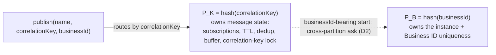
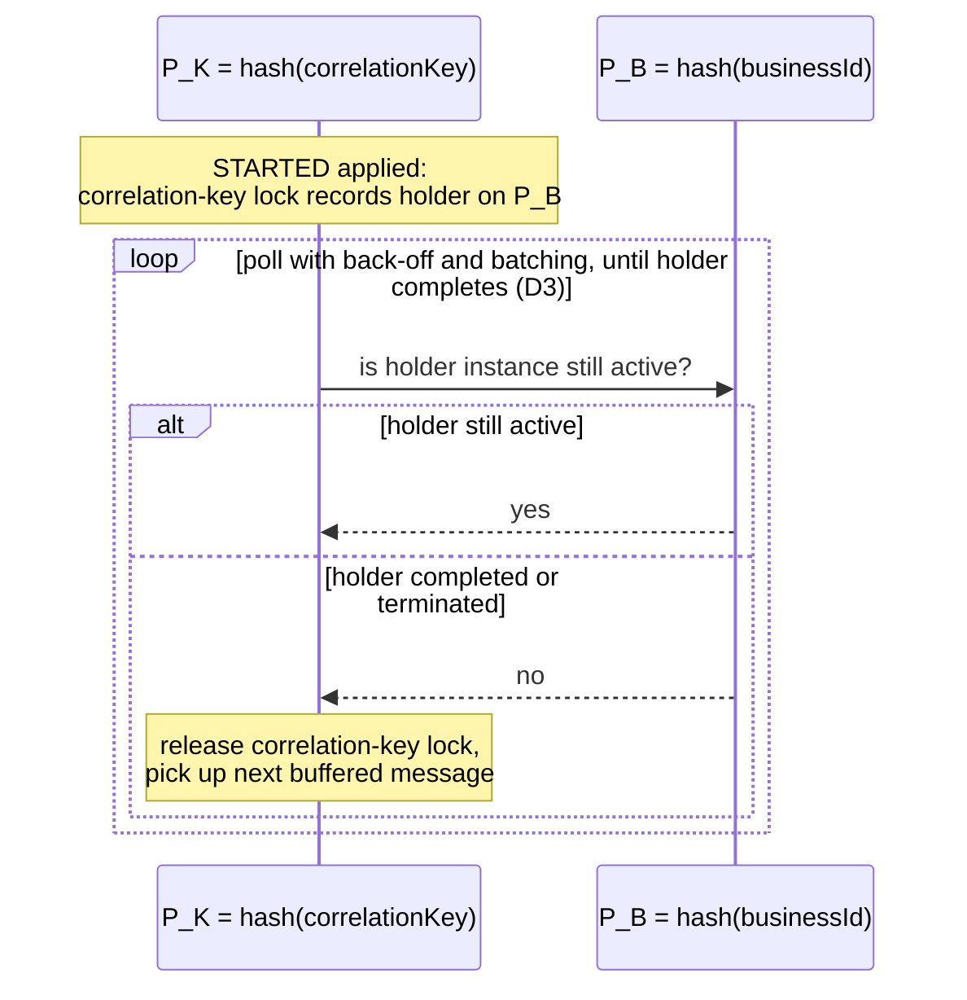
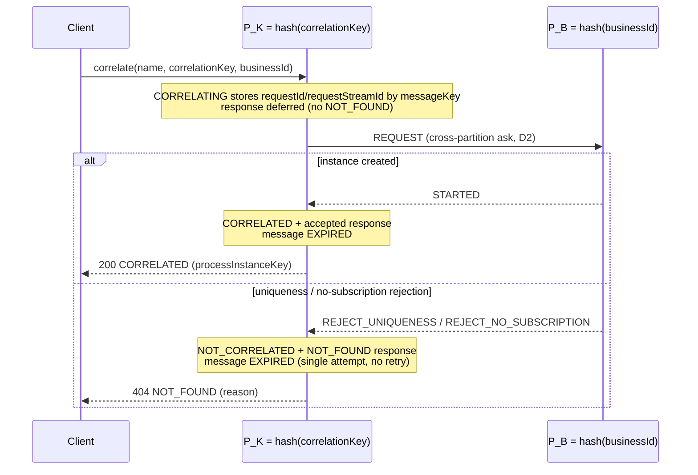

# Business ID message correlation: P_K owns messages, P_B enforces uniqueness, P_K pulls for release

**DRI**: Mustafa Dagher

**Status**: Accepted (8.10)

**Purpose**: Defines how Business ID interacts with cross-partition message routing for message
events, so the existing message and uniqueness routing contracts are both preserved.

**Audience**: Zeebe engine engineers and AI agents working on message correlation or partitioning.

## Context

A message is routed to `P_K = hash(correlationKey)`, where all of its lifecycle state lives
(subscriptions, TTL, deduplication, buffering, the process-correlation-key lock). A process instance
with a `businessId` is owned by `P_B = hash(businessId)`, where Business ID uniqueness is a local
lookup. When Business ID is used as an additional filter on message events, a single publish can
carry a `correlationKey` and a `businessId` whose hashes resolve to different partitions, so the
message and the instance it would create no longer co-locate.

The outcome: message routing is unchanged; `P_K` remains the single owner of message state and
`P_B` remains the single owner of Business ID uniqueness. Message-start events bridge the two
partitions with a cross-partition ask; other message events filter locally; and the resulting
cross-partition lock is released by `P_K` polling `P_B`.

## Decision

**D1. `P_K` owns message state; `P_B` owns Business ID uniqueness.** Messages keep routing by
`hash(correlationKey)`. Subscriptions, TTL, dedup, buffering, and the correlation-key lock stay on
`P_K`; the uniqueness check stays a local lookup on `P_B`. Neither concern is relocated or
duplicated.

The partition split — a single publish can land its message and its instance on different partitions:

**D2. Message-start events reconcile the two partitions with a cross-partition ask.** When a
businessId-bearing start would create its instance on a different `P_B`, `P_K` sends a `REQUEST` to
`P_B`, which creates the instance locally and replies `STARTED`, or declines with `REJECT_UNIQUENESS`
(an active instance already holds the businessId) or `REJECT_NO_SUBSCRIPTION` (the start-event
subscription has not yet been distributed to `P_B`). On a rejection the message stays buffered on
`P_K`.

The pull-based release (D3), continuing from the `STARTED` reply above:

**D3. The cross-partition correlation-key lock is released by pull, not push.** For a remotely
created start, `P_K` records the holder instance and polls `P_B` (with back-off and batching) for
that specific instance's completion, then releases the lock and picks up the next buffered message —
keeping lock semantics identical to a single-partition start. Locally created starts use the
existing local release path unchanged.

**D4. Cross-partition creates are idempotent via a dedup row on `P_B`.** `P_B` records
`(processDefinitionKey, messageKey) → processInstanceKey` with a deletion deadline equal to the
message deadline. At-least-once ask retries either hit this row (re-reply the same instance, no
second create) or arrive after it and the buffered message have expired together. The contract
`retryDeadline <= messageDeadline` is what prevents duplicate instances.

**D5. Catch, boundary, and intermediate message events filter Business ID locally, not via the ask.**
A subscription stores its instance's `businessId` at open time. Correlation applies an asymmetric
local match: a message without a `businessId` correlates regardless; a message with one correlates
only to a subscription whose stored `businessId` matches exactly. Only start events need a uniqueness
check, and only `P_B` can answer it — hence the asymmetry with D2.

**D6. A synchronous `correlate` defers its response; the `P_K` reply processors resolve it.** D2–D5
describe the asynchronous `publish`, which has no waiting client — a delegated start simply proceeds
and a rejected one stays buffered. A synchronous `POST /messages/correlation`, by contrast, has a
client blocked on the outcome. When the only correlation on `P_K` was a start delegated to `P_B`,
`P_K` must not answer `NOT_FOUND`: the instance is being created remotely, so the response is
deferred. The `CORRELATING` event already records the request (`requestId`, `requestStreamId`) keyed
by `messageKey` — the same deferral used for cross-partition catch-event correlation — and the three
reply processors resolve it: `STARTED` → `CORRELATED` + accepted response; `REJECT_UNIQUENESS` /
`REJECT_NO_SUBSCRIPTION` → `NOT_CORRELATED` + a `NOT_FOUND` rejected response carrying the reason.
Resolution is idempotent (the terminal applier removes the stored request) and a no-op for a
`publish` (no stored request). The deferral is scoped to a genuine delegation (`P_B != P_K`): a
start the local partition attempted but could not create — its definition draining or removed, so
the local trigger reports "nothing started" — is not a delegation and is answered `NOT_FOUND`
immediately, never deferred.

**A rejected correlate is single-attempt: its message is expired, not buffered for retry.** This is
the correlate/publish split of D2. A correlate carries no TTL (fire-and-forget), so on a
`REJECT_UNIQUENESS` / `REJECT_NO_SUBSCRIPTION` the reply processor expires the buffered message — the
same `EXPIRED` the success path already writes — which both removes the message and clears the
pending ask, stopping the retry scheduler. Without this, the ask (backed off by the rejection
applier, cleared only by a success or by the message's TTL) would keep retrying and could start an
instance _after_ the client already received `NOT_FOUND`. A `publish` keeps the opposite contract:
its rejected message stays buffered and is retried until it starts or its TTL expires (D2 /
[ADR 0002](0002-810-message-start-rejection-retry.md)).

**The rejection is reported as `NOT_FOUND` (HTTP 404), matching the single-partition path.** The
local active-instance block already answers a correlate with `NOT_FOUND`, and the cross-partition
arm answers with the same rejection type and status, so the client-visible outcome does not depend
on whether `hash(businessId)` and `hash(correlationKey)` co-locate.

The deferred correlate response, layered on the D2 ask/reply:

## Alternatives considered

- **Combined-hash routing `hash(correlationKey + businessId)`.** Co-locates the lock and the
  uniqueness check on one partition, but breaks both existing routing contracts and cannot satisfy
  the requirement that a message without a `businessId` still correlates to an instance that has one
  (it would route to a different partition than the subscription).
- **`P_B` owns blocked starts; `P_K` forwards-and-forgets.** Moves the message itself to `P_B` on
  forward. Relocates cross-partition state rather than removing it, and breaks `messageId`
  deduplication and correlation to processes that listen for the same message without a Business ID.
- **Push-based release notification from `P_B`.** `P_B` would track which partitions hold dependent
  work and notify them on each completion. Rejected: it requires per-waiter bookkeeping and reliable
  delivery on `P_B`, is not self-healing across restarts/leadership changes, and has no decisive
  efficiency advantage over the pull (D3).

## Consequences

- Existing routing contracts for `correlationKey` and `businessId` are preserved; message lifecycle
  stays observable from one partition per correlation key.
- New cross-partition machinery is confined to the message-start path: an ask with three reply
  outcomes, a per-`P_K` record of remotely held locks, and the dedup row on `P_B`.
- A synchronous `correlate` to a cross-partition start is answered exactly once, when its remote
  outcome is known, by reusing the existing request-deferral state — so it never reports a spurious
  `NOT_FOUND` while the instance is being created (D6, closing camunda/camunda#58207).
- The pull keeps all reaction-to-completion logic on the partition that owns the work and is
  self-healing, at the cost of added latency on the release path (bounded by the poll interval and
  back-off).
- A start rejected purely on Business ID uniqueness stays buffered and relies on its TTL and existing
  buffered-message triggers, matching single-partition behaviour. Proactively retrying it when the
  Business ID frees is decided separately in
  [ADR 0002](0002-810-message-start-rejection-retry.md).

## Source

- [Business ID + message correlation — design thread 1](https://camunda.slack.com/archives/C0AF71HUQ5V/p1776937625439169) (internal)
- [Business ID + message correlation — design thread 2](https://camunda.slack.com/archives/C0AF71HUQ5V/p1777043511569139) (internal)
- [Process Instance Creation: Message event](https://docs.camunda.io/docs/next/components/concepts/process-instance-creation/#message-event)

