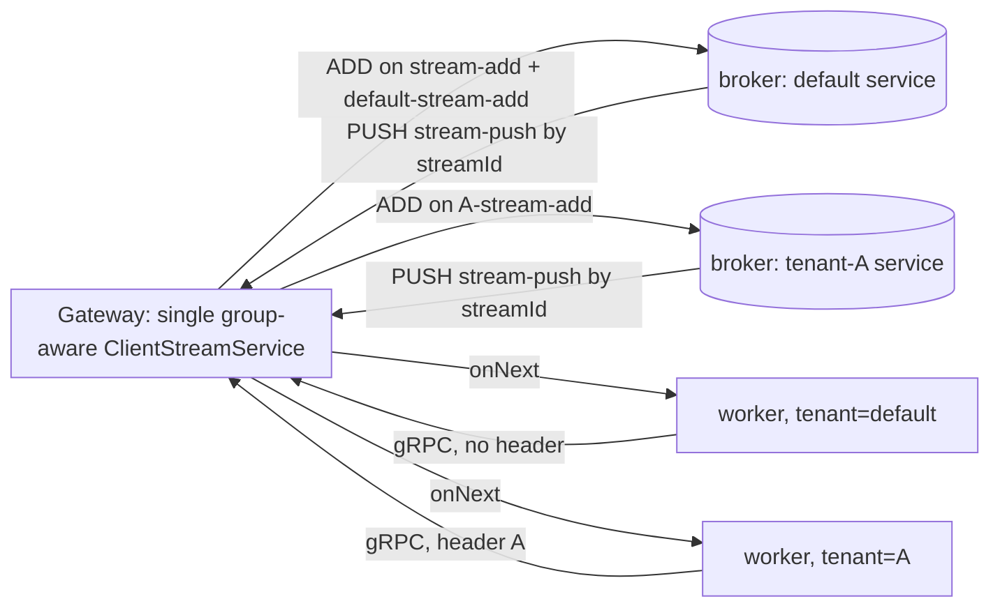

# Physical-tenant-aware job streaming

**DRI**: Lena Schönburg

**Status**: Proposed (8.10)

**Purpose**: Defines how gRPC job streaming (job push) is made aware of physical tenants, so a job
worker streams jobs from exactly one physical tenant in full isolation, while staying wire-compatible
with 8.9 during a rolling upgrade.

**Audience**: Zeebe engineers working on the gateway, broker job-stream transport, or the physical
tenants epic, and AI agents reasoning about job streaming or partition groups.

## Context

A physical tenant is an independent process engine running as its own Raft partition group within a
shared set of broker nodes (the [physical tenants epic](https://github.com/camunda/camunda/issues/50509)).
Partition IDs are composite keys `(partition group, numeric id)`; numeric ids overlap across groups.
A single broker hosts partitions from multiple groups, and the broker already runs one engine /
`PartitionManager` per physical tenant. The gateway selects the target tenant from the
`Camunda-Physical-Tenant` gRPC header, defaulting to `default` when absent.

Job streaming was explicitly **out of scope** for the first physical-tenant increments and is the
subject of its own milestone (~8.10.0-alpha3/4). Today it has **zero** partition-group awareness:

- The gateway (`StreamJobsHandler` → `JobStreamClientImpl` → `ClientStreamManager`) registers each
  worker stream with **every** broker — a flat `Set<MemberId>`, re-broadcast on every `onServerJoined`.
- The broker (`RemoteStreamRegistry` / `RemoteStreamerImpl.streamFor`) matches a job to a stream only
  by `(streamType, metadata)` and picks a random match. The control transport
  (`RemoteStreamTransport`) subscribes the five fixed, global topics in `StreamTopics`: `stream-add`,
  `stream-push`, `stream-remove`, `stream-remove-all`, `stream-recreate`.
- The broker bootstrap (`JobStreamServiceStep`) creates **one** `RemoteStreamService` +
  `RemoteJobStreamer` + `RemoteJobStreamErrorHandlerService` per broker, shared across all tenants.
  `PartitionManager.createPartitionManager(..., physicalTenantId, ...)` is already invoked per tenant,
  but still pulls the single global streamer (`getJobStreamService().jobStreamer()`).
- `JobActivationProperties` (the SBE-serialized stream metadata) carries the worker, timeout, fetch
  variables, and **logical** `tenantIds` — but no physical tenant. Logical `tenantIds` filter *within*
  an engine; the physical tenant selects *which* engine. The two axes must not be conflated.

The hard constraint: a mixed-version cluster during a rolling upgrade from 8.9 must keep working, in
both directions (8.9 gateway ↔ 8.10 broker, and 8.10 gateway ↔ 8.9 broker).

## Decision

**D1. Pursue true per-partition-group isolation, not metadata-filter scoping.** The broker runs one
job-stream service per physical tenant — its own `RemoteStreamService`, registry, `RemoteJobStreamer`,
and error handler — mirroring the established "one `CommandApiService` per partition group" pattern.
A job activated in group *G* is only ever matched against streams registered for *G*. This is chosen
over the cheaper alternative of keeping a single shared registry and filtering by a physical-tenant
field on the stream metadata (see Alternatives), which would leave the shared, single-threaded
registry in place and provide no real isolation.

**D2. Scoping happens at stream registration, addressed by partition group — not by a field on
`JobActivationProperties`.** The gateway reads the `Camunda-Physical-Tenant` header (absent ⇒
`default`, consistent with the rest of the epic) and registers the stream into the target group only.
The job-push payload and `JobActivationProperties` wire layout are left unchanged. (A `physicalTenantId`
may still be added to the *activated job* for the connectors/secrets work; that is a separate need and
must not be conflated with stream routing.)

**D3. Only the four control topics become partition-group-scoped; PUSH stays global.** `ADD`,
`REMOVE`, `REMOVE_ALL`, and `RESTART_STREAMS` get a per-group topic name, `<group>-<topic>`. The
hot-path `PUSH` is **not** scoped: `RemoteStreamPusher` already unicasts a `PushStreamRequest` to
`streamId.receiver()` (the owning gateway), and the gateway routes it by the globally unique
`streamId`. Isolation is achieved entirely at registration, so the push itself needs no group and
carries zero added overhead.

**D4. The default tenant keeps the legacy prefix-less topics as its canonical names during the
transition.** `StreamTopics` becomes group-parameterized: `topic(group)` returns the legacy name
(`stream-add`, …) for the `default` group and `<group>-<topic>` otherwise. Non-default tenants only
ever exist on a fully-8.10 cluster, so an 8.9 node never sees a group-prefixed topic, and the entire
backwards-compatibility surface collapses to "the default tenant must be wire-identical to 8.9."

**D5. To allow removing the legacy topics in 8.11, 8.10 nodes both *subscribe to* and *send on* the
`default-*` topics in addition to the legacy ones.** Listening on both is necessary but not
sufficient: deleting the legacy topic next version also requires senders to already use the new topic
in 8.10, and to stay reachable by legacy-only 8.9 receivers that means **dual-sending** the default
control messages on both the legacy and the `default-*` topic. This is safe because
`RemoteStreamRegistry.add` is idempotent — a stream is keyed by `(streamId, receiver)` and a repeat
ADD early-returns; `REMOVE`/`REMOVE_ALL` are idempotent too. Roles by topic: for `ADD`/`REMOVE`/
`REMOVE_ALL` the gateway is the sender and the broker the receiver; for `RESTART_STREAMS` the broker
is the sender and the gateway the receiver — so both nodes subscribe-both and dual-send their
respective default control messages.

- **8.10**: default canonical = legacy names; also subscribe `default-*` and dual-send on both.
  Duplicate control messages are deduped by `(streamId, receiver)`. Only control-plane traffic (stream
  open / close / restart) is duplicated — never per-job pushes.
- **8.11**: the 8.9 → 8.10 upgrade is complete, so every live node already speaks `default-*`; drop the
  legacy subscriptions and the dual-send. The default tenant becomes just another `<group>-*`, with no
  special case left.

This relies on Camunda's single-step rolling-upgrade guarantee (8.9 → 8.10 fully completes before any
8.11 node joins). The fallback, if dual-send is undesirable, is to send legacy-only in 8.10 and remove
the legacy topics one version later, in 8.12.

**D6. The per-tenant job-stream service is wired in by partition group at the existing seam, and its
error handler is registered per tenant.** `JobStreamServiceStep` builds a
`Map<physicalTenantId, JobStreamService>` (each entry on its group's topics, default on legacy),
following the `Map<tenantId, T>` pattern already used for per-tenant security config and feature
flags. `PartitionManager.createPartitionManager` resolves the streamer for its own
`physicalTenantId`. Each group's `RemoteJobStreamErrorHandlerService` is registered as a
`PartitionListener` from its per-tenant `PartitionManager` (which knows its own partitions) rather
than once globally. Because each handler then only ever sees its group's partitions, the handler's
existing bare-`int` partition-id keying (`Protocol.decodePartitionId`) is unambiguous — so the
group-aliasing latent in a single shared handler is resolved structurally, without widening the
`PartitionListener` interface to carry the group.

**D7. The gateway keeps a single, group-aware `ClientStreamService` — it is not sharded per tenant.**
Streams gain a partition-group attribute; the request manager directs `ADD`/`REMOVE` to the group's
topic and to the brokers hosting that group (derived from the partition-group field already on
`BrokerInfo`). A single shared `PUSH`/`RESTART_STREAMS` handler is kept. Sharding the gateway's
single-threaded `BrokerClient` / stream service per tenant — a known scalability bottleneck — is
explicitly deferred to a later milestone and is not pulled forward by this work.

## Alternatives considered

- **Metadata-filter scoping (path A).** Add `physicalTenantId` to `JobActivationProperties`, keep the
  single shared broker registry, and have `streamFor`'s predicate match the physical tenant. Cheapest,
  reuses the existing authorization-predicate hook. Rejected as the target design: every broker still
  holds every stream, the single-threaded registry / `BrokerClient` bottleneck is untouched, and it
  provides no real isolation — only delivery filtering. It would leave the "do it properly" work for a
  later version, which this decision explicitly avoids.
- **Carry the partition group in the `RESTART_STREAMS` payload instead of the topic.** The request is
  currently empty; the group could ride in the payload on a single global topic. Rejected for
  uniformity: making all four control topics group-scoped is one mechanism instead of two, and
  `RESTART_STREAMS` on `<group>-stream-recreate` already tells the gateway which group's streams to
  re-register.
- **Legacy-send-only in 8.10 (remove legacy topics in 8.12).** Subscribe-both in 8.10 but keep sending
  default on the legacy topic only; switch senders to `default-*` in 8.11; remove legacy in 8.12. Fully
  safe and avoids dual-send, but defers legacy removal by one extra version. Dual-send (D5) is preferred
  because the duplicate traffic is control-plane-only and idempotent, and it buys removal a version
  earlier.
- **One `ClientStreamService` per tenant on the gateway.** Maximizes gateway-side isolation and would
  let `PUSH`/`RESTART` also be group-scoped. Deferred: it forces the gateway to shard its single-threaded
  actor now, which is a separate, benchmarked scalability decision (the `BrokerClient`-per-tenant
  follow-up), and is not required to deliver per-tenant *job delivery* isolation.
- **Widen `PartitionListener` to carry the partition group.** Would let a single global error handler
  disambiguate partitions by group. Not needed here: per-tenant handler registration (D6) makes the
  bare-`int` key unambiguous without an interface change.

## Consequences

- A worker streaming with a given physical tenant receives jobs only from that tenant; jobs from other
  tenants are never matched to its stream, because each tenant has its own broker-side registry.
- The broker holds N job-stream services (one per configured physical tenant) instead of one. Each is
  an independent actor/registry, which also lays the groundwork for per-tenant resourcing later.
- The job-push hot path is unchanged: same topic, same payload, same unicast-by-`streamId` routing — no
  added per-job overhead from physical tenants.
- 8.9 ↔ 8.10 job streaming interoperates in both directions, carrying only default-tenant traffic
  during the mixed-version window (non-default tenants are not configurable until the cluster is fully
  8.10). The legacy prefix-less topics are removable in 8.11.
- The bare-`int` partition keying in the error handler stops aliasing across groups, by construction,
  once the handler is registered per tenant.
- The broker-to-gateway work-available notification (`notifyWorkAvailable`) stays cluster-wide and is
  **not** group-scoped. Its only consumer is the gateway `LongPollingActivateJobsHandler`, which keys
  solely on job type, has no notion of physical tenants, and is woken by a notification that carries no
  job — only a job-type signal. A notification raised in one physical tenant may therefore wake a
  long-poll request of another tenant for the same job type, but the woken request re-issues an
  `ActivateJobs` poll that is already routed to its own partition group, finds nothing, and resumes. No
  job ever crosses tenants; the only cost is a spurious wakeup. This is accepted and left to be
  optimized by the separate long-polling isolation work.
- Out of scope, consistent with the milestone: REST job streaming, authentication/authorization for
  streaming, streaming from multiple physical tenants over one stream, gateway `BrokerClient` sharding,
  and group-scoping the work-available (`notifyWorkAvailable`) notification.

## Source

- [Strong Tenant Isolation — design & planning doc](https://docs.google.com/document/d/1hLdPXbKNZvijRxwFn-N1QUW8pAMXX4vZtrrnpAr9TGM)
  (internal) — Breakdown Task 5 / Increment 5.
- [Physical Tenants epic — #50509](https://github.com/camunda/camunda/issues/50509).

