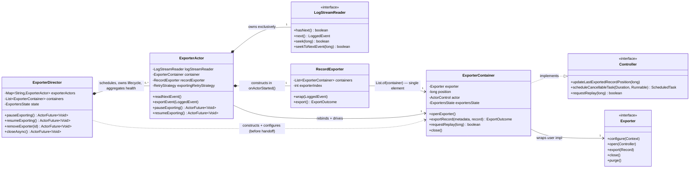
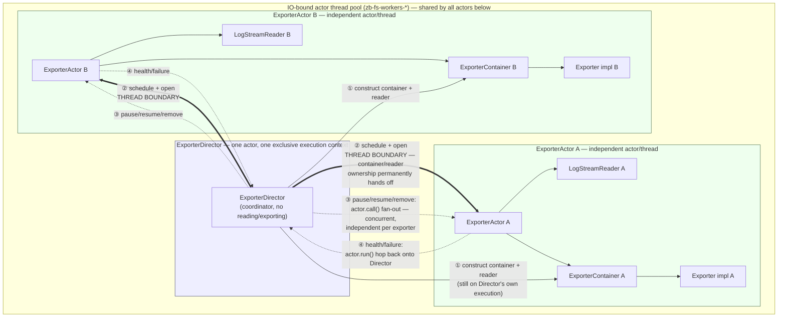

# Concurrent exporters: solution proposal

Companion implementation design for
[ADR 0007: Concurrent, decoupled exporters](../adr/0007-TBD-concurrent-exporters.md). The ADR
records the decision; this document covers the class-level design, migration path, and testing
plan that the ADR deliberately excludes.

## 1. Current-state recap

One `ExporterDirector` actor per partition
(`zeebe/broker/src/main/java/io/camunda/zeebe/broker/exporter/stream/ExporterDirector.java`) owns:

- a single shared `LogStreamReader` (`ExporterDirector.java:80`, opened in `onActorStarting`/
  `restartActiveExportingMode`)
- an `ArrayList<ExporterContainer>` (`ExporterDirector.java:73`), one container per configured
  exporter
- a `RecordExporter` (`RecordExporter.java`) that wraps each read record once and then walks the
  container list via a shared `exporterIndex` cursor: `export()` calls
  `container.exportRecord(...)` for the container at the current index; if it returns `true`
  (accepted or successfully retried) the index advances, otherwise the loop returns immediately
  with the index unchanged, so the *same* container is retried on the next attempt before any
  container after it in the list is even called for that record.

`ExporterDirector.readNextEvent()` only reads the next record once `RecordExporter.export()` has
returned `true` for the current one — i.e., once every container has accepted it. This is the
head-of-line blocking mechanism: containers positioned after a stuck one in the list never even see
new records until the stuck one clears, and the reader itself cannot move forward either.

## 2. Target class design

> **As implemented:** the class-level shape below shipped largely as proposed, with two naming
> deviations kept deliberately for a smaller diff: the coordinator class kept the name
> `ExporterDirector` rather than being renamed to `ExporterCoordinator`, and `RecordExporter` was
> kept rather than deleted — each `ExporterActor` constructs its own `RecordExporter` over a
> single-element container list (`List.of(container)`), so its per-record loop degenerates to one
> iteration instead of walking a shared list. See §8 for the as-built runtime diagrams.

### `ExporterActor` (new)

One instance per configured exporter per partition. Folds in the per-exporter fields currently on
`ExporterContainer` (`position`, `lastAcknowledgedPosition`, `lastUnacknowledgedPosition`,
soft-pause flag, `ExporterReplayControl`) plus:

- its own `LogStreamReader`, opened at its own persisted position on start
- its own `BackOffRetryStrategy` (replacing the single `exportingRetryStrategy` shared by
  `ExporterDirector` today)
- its own read loop: read next event → apply this exporter's filter → export with retry → on
  success, advance this exporter's position and read the next event. No cross-exporter cursor.
- implements `HealthMonitorable`, reporting only its own health

`ExporterContainer.exportRecord`/`updatePositionOnSkipIfUpToDate`/`requestReplay`/
`softPauseExporter`/`undoSoftPauseExporter` move onto `ExporterActor` largely unchanged in logic —
the behavior per exporter is the same, only the driving loop around it changes.

### `ExporterCoordinator` (as implemented: kept the name `ExporterDirector`)

Owns a `Map<String, ExporterActor>` instead of the `ArrayList<ExporterContainer>` +
`recordExporter.resetExporterIndex()` dance. Responsibilities:

- partition transition: on leader, schedules one `ExporterActor` per configured exporter via
  `actorSchedulingService.submitActor(child, SchedulingHints.ioBound())`; on follower, schedules
  none (followers never read the log — only the distribution-consumption path runs, as today)
- lifecycle fan-out: `pauseExporting`/`softPauseExporting`/`resumeExporting` become a future over
  `allOf` of each child's own call; `enableExporter`/`enableExporterWithRetry` spawn and schedule a
  new child; `removeExporter` closes the child, waits for its actor to fully stop, then removes its
  state row (avoids a write race between the closing actor and the coordinator)
- health aggregation: subscribes as `FailureListener` to every child, aggregates worst-of (`dead` if
  any child is dead, `unhealthy` if any is unhealthy, `healthy` otherwise) as the partition's single
  `HealthReport`, preserving today's one-registration-per-partition contract while isolating
  failure per exporter
- owns `ExporterStateDistributionService` exactly as today — a single batch broadcast of all
  exporters' positions, built from `ExportersState.visitExporterState`, unchanged in wire format

### `RecordExporter` (as implemented: kept, scoped to a single container)

Its only purpose was the shared `exporterIndex` cursor across multiple containers. With one
container per actor, there is no list to walk; exporting a record is a direct
retry-until-success call on that actor's own record. Rather than deleting the class, each
`ExporterActor` constructs its own `RecordExporter` over `List.of(container)` — a single-element
list — so the existing per-record loop still runs, it just always terminates after one iteration.

## 3. State ownership and RocksDB access

`ExportersState` (`ExportersState.java`) keeps its existing schema: a single RocksDB column family
(`ZbColumnFamilies.EXPORTER`) keyed by exporter id, storing `{position, metadata, metadataVersion}`.
No migration is needed — each exporter's row is already independent.

What changes is who writes to it. Today, one `TransactionContext` (created once in
`ExporterDirector.recoverFromSnapshot()`) is shared by the single actor for all containers. Under
this design, each `ExporterActor` creates its own `TransactionContext` via `zeebeDb.createContext()`
and constructs its own `ExportersState` instance bound to that context, writing only its own row.
This mirrors the pattern already used by `DbPositionSupplier`
(`zeebe/broker/src/main/java/io/camunda/zeebe/broker/logstreams/state/DbPositionSupplier.java`),
which today creates an independent context to read exporter positions off the exporting actor's
thread entirely — proof that concurrent, independently-owned transaction contexts against this
column family are already safe in this codebase.

Compaction's read path (`ExportersState.getLowestPosition()` →
`DbPositionSupplier.getLowestExportedPosition()` →
`StateControllerImpl.tryFindNextSnapshotId()` →
`LogCompactor`) needs no change: it already reads through its own independent context regardless of
which actor last wrote to the rows it scans.

## 4. Partition transition and lifecycle

`ExporterDirectorPartitionTransitionStep`
(`zeebe/broker/src/main/java/io/camunda/zeebe/broker/system/partitions/impl/steps/ExporterDirectorPartitionTransitionStep.java`)
changes to build an `ExporterCoordinator` instead of an `ExporterDirector`. `PartitionContext`'s
`getExporterDirector()`/`setExporterDirector()` accessors are renamed to hold the coordinator; all
other call sites (`BrokerAdminServiceImpl`, admin/status reporting) go through the coordinator's
equivalent API (e.g. `getLowestPosition()` stays a coordinator method backed by the same
`DbPositionSupplier`-style independent read).

Dynamic exporter reconfiguration (enable/disable/remove at runtime, exporter added/removed from
broker config) goes through the coordinator, which starts or stops the corresponding
`ExporterActor` without affecting any other exporter's actor.

## 5. Monitoring and mitigation for the retention consequence (ADR D4)

Since a stalled exporter can now diverge arbitrarily from its siblings, add:

- a per-exporter position-lag metric: `logHeadPosition - exporterPosition`, exposed per exporter id
- a position-spread metric: `max(exporterPosition) - min(exporterPosition)` across configured
  exporters on a partition, as a single signal for "how much is decoupling costing us in retention
  right now"
- operator documentation: how to identify a chronically stalled exporter from these metrics, and
  how to pause or remove it to unblock compaction, since compaction cannot advance past it
- a suggested default alert threshold on sustained per-exporter lag (exact threshold is an
  operational tuning decision, not an architectural one — left to rollout, not this document)

## 6. Rollout plan

RocksDB schema is unchanged, so this refactor is safe across rolling upgrades with no data
migration and no version-skew handling beyond what already exists for the state column family. No
persisted feature flag is required for this reason. Given the size of the structural change
(partition transition wiring, health aggregation, and the full lifecycle API surface), an internal
soak period ahead of general availability is recommended, gated on the acceptance test in §7
passing under sustained load with an intentionally stalled exporter.

## 7. Testing plan

- Replace `ExporterDirectorTest` with `ExporterActorTest`, covering the same invariants against a
  single actor: retry-until-success, skip-record position updates, snapshot/position recovery,
  filter application.
- Add `ExporterCoordinatorTest`: lifecycle fan-out (enable/disable/remove/pause/resume across
  multiple children), aggregated health (worst-of semantics), stale exporter-state cleanup on
  startup.
- Retarget `ExporterDirectorPauseTest` and `ExporterDirectorDistributionTest` at the coordinator;
  behavior (pause/soft-pause/resume semantics, leader→follower state distribution) is unchanged in
  contract, only in which class implements it.
- Retarget `ExporterDirectorPartitionTransitionStepTest` at coordinator construction.
- Add the key acceptance test that does not exist today, and is the direct regression guard for
  camunda/camunda#44931: with two or more exporters configured, one exporter fails/stalls
  indefinitely while the others continue to advance their own positions and export new records
  without delay.
- Add a reader-lifecycle test confirming no `LogStreamReader` is leaked across exporter add/remove.
- Add a compaction regression test with deliberately divergent per-exporter positions, confirming
  `getLowestPosition()` still returns the true minimum and compaction still never deletes segments
  the slowest exporter has not consumed.

## 8. Runtime architecture (as implemented)

This section documents the shipped code, not the plan — see the note in §2 for the two naming
deviations. It focuses on two things: how the classes relate to each other, and — the part that
matters most for a concurrency refactor — exactly where a thread/actor boundary sits, since that is
what determines whether two exporters can genuinely make progress at the same time.

### 8.1 Class relationships



Note the asymmetry: `ExporterDirector` **constructs** each `ExporterContainer` and its
`LogStreamReader` up front (`createContainer`/`initContainers`), but ownership of both is
permanently handed off to that exporter's `ExporterActor` before it ever opens the exporter or reads
a record — from that point on, `ExporterDirector` never touches them again. `RecordExporter` still
has the shape of "iterate over a list of containers" from the old shared-cursor design, but each
`ExporterActor` only ever gives it one container, so that loop always runs exactly once per record.

### 8.2 Actor/thread topology — where the concurrency actually is

Every actor in this diagram is scheduled with `SchedulingHints.ioBound()` onto the same shared
IO-bound thread pool, but each **actor** is single-threaded and mutually exclusive with itself: the
scheduler guarantees only one job of a given actor runs at a time, though *which* physical worker
thread runs it can vary between jobs. What changed in this refactor is not the pool — it's how many
independent actors (and therefore how many independently-progressing execution contexts) exist per
partition.



Reading this diagram as the answer to "where does concurrency happen":

1. **Construction (①)** happens on the Director's own execution, before any handoff — this is
   inherently sequential and cheap (no I/O), so it isn't a bottleneck.
2. **The thread boundary (②)** is the one-way handoff: `ExporterDirector.scheduleExporterActor()`
   submits a brand-new `ExporterActor` to the scheduler, and that actor's own `onActorStarted()`
   rebinds the container's `ActorControl` to itself before opening the exporter (see the comment in
   `ExporterActor.onActorStarted()` for why this ordering matters — an exporter can schedule a
   periodic task synchronously from `open()`, and that task must be bound to the right actor from
   the start). After this point, `ExporterContainer`, `LogStreamReader`, and `RecordExporter` for
   that exporter are touched exclusively by that one `ExporterActor` — never by the Director, never
   by another exporter's actor. **This is the actual concurrency**: exporter A's read-export-retry
   loop and exporter B's are two independent actors, so a slow or stuck `Exporter.export()` call in
   A never blocks B's own loop from advancing, and the two can be scheduled onto different physical
   worker threads at the same time.
3. **Control-plane calls (③)** — pause, resume, soft-pause, remove — still originate from the
   Director's thread but fan out as independent `actor.call(...)`/`closeAsync()` calls, one per
   child, each crossing its own thread boundary; a slow exporter responding to a pause request
   doesn't block another exporter's pause from completing.
4. **Health/failure reporting (④)** flows the other way: each `ExporterActor` registers itself as a
   `FailureListener` source, and reports hop back onto the Director's own actor via `actor.run(...)`
   so that health aggregation (`HealthReport.fromChildrenStatus`) and the single
   `HealthMonitorable` registration point stay single-threaded from the Director's perspective, even
   though the failures themselves can arrive concurrently from any number of exporter actors.

No arrow ever goes directly between `actorA` and `actorB` — that absence is the whole point of the
redesign. The old design had one actor, one `LogStreamReader`, and one shared `exporterIndex` cursor
walking every container in lock-step, so a stuck exporter blocked the reader itself from advancing
for every other exporter too. Now each exporter has its own reader, its own container, and its own
actor, so nothing about exporter B's progress can be observed by, or depend on, exporter A's actor.

### 8.3 One exporter's read-export loop — entirely inside its own actor

This is the loop that actually runs concurrently across exporters (per §8.2). Within a single
`ExporterActor`, though, it's strictly sequential — the actor model gives single-threaded semantics
for free, so there's no additional locking inside `ExporterContainer`/`RecordExporter`.

```mermaid
sequenceDiagram
    participant LSR as LogStreamReader (A)
    participant AA as ExporterActor (A)
    participant RE as RecordExporter (A)
    participant EC as ExporterContainer (A)
    participant EX as Exporter impl (A)

    Note over AA,EX: Everything below runs on ExporterActor A's own actor thread.<br/>Exporter B's actor is never involved and never blocked by this.

    AA->>LSR: hasNext() / next()
    LSR-->>AA: LoggedEvent
    AA->>RE: wrap(event)
    AA->>RE: export()
    RE->>EC: exportRecord(metadata, typedEvent)
    EC->>EX: export(record)
    alt exported successfully
        EC-->>RE: ExportOutcome.EXPORTED
        RE-->>AA: EXPORTED
        AA->>AA: actor.submit(readNextEvent) — next tick, same actor
    else Exporter.export() throws
        EC-->>RE: ExportOutcome.RETRY
        RE-->>AA: RETRY
        AA->>AA: BackOffRetryStrategy reschedules export()<br/>after backoff — still the same actor, same thread
    else ExporterException(REOPEN) triggers a reopen mid-stream
        EC->>EC: reopenExporter() → exporter.close(); exporter.open(this)
        EC-->>RE: ExportOutcome.ABORT_REPLAY
        RE-->>AA: ABORT_REPLAY
        AA->>AA: abandon record, actor.submit(readNextEvent)<br/>(record is redelivered once reading resumes)
    end
```

The three branches above are the entire failure-isolation story: a permanently-throwing exporter
just keeps retrying (with backoff) on its own actor forever, on a log reader no other exporter
shares, without any other exporter's loop ever being aware it's happening.

