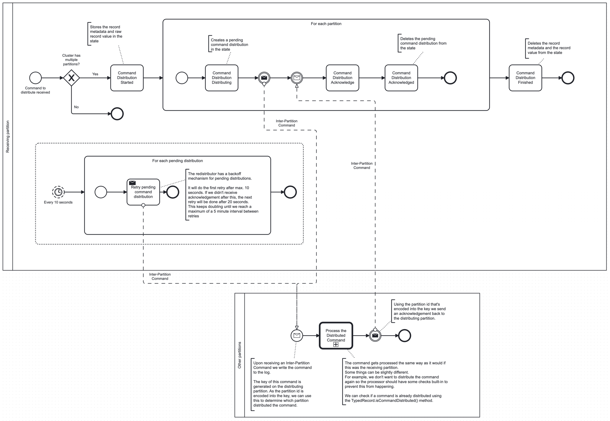

# Generalized distribution

As of Zeebe version 8.3 we have introduced a generic way to distribute commands to other partitions.
We felt the need to generalize this as we are seeing more feature requests that will require
distribution.

## Why do we need to distribute commands?

Zeebe is a distributed system. We have multiple partitions working together to achieve high
availability and performance.

When we deploy a new process this process must be available on all
partitions. If this is not the case we would only be able to start instances of this process on a
single partition. By distributing it instances can be started across all partitions.

Like deployed processes, other parts of the system also need to distribute the related entities.
Rather than build the same feature many times, we've built a generic solution that allows
distributing a command to other partitions.

## How do we distribute commands?

On a high-level we use commands and events to distribute commands. The image below provides a nice
overview of the flow of commands and events that are written during distribution.

Note that `CommandDistribution` records only exist on the partition that initiated the distribution.
The other partitions only receive the specific command that is distributed.



The distribution starts when a processor calls the `distributeCommand` method on
the `CommandDistributionBehavior`. It needs to pass a key, which will be used to store the pending
distribution.
In general this should be the same as command that is getting distributed as it makes it possible to
correlate the two.

Once the method has been called we write a `CommandDistribution.STARTED` event. After this we will
write a `CommandDistribution.DISTRIBUTING` event for each of our other partitions. With this we can
keep track of what is distributed and to which partitions it is distributed.
The actual distribution to the other partitions is done using the `InterPartitionCommandSender`.
This sends an SBE message to the other partitions containing the command that's being distributed.

Every other partition will write the command to their log and process it. This will be the same
processor that's used on the distributing partition. As a result we must make sure we don't
distribute te command again! For this we have the `isCommandDistributed` method on
the `TypedRecord`. We can detect if a command is distributed by checking the key. Encoded within the
key is the partition id that generated it. If this doesn't match the partition id that is processing
the command, it has been distributed before.

> [!TIP]
> Typically, you want to implement `DistributedTypedRecordProcessor` rather than
> `TypedRecordProcessor` to differentiate between new and distributed commands in the processor.

At the end of processing the processor must acknowledge the distribution by calling
the `acknowledgeCommand` method on the `CommandDistributionBehavior`. This method will decode the
original partition id from the key and, similar to the distribution, will use
the `InterPartitionCommandSender` to send acknowledgement back to the original partition.

Once the original partition receives this message it writes the `CommandDistribution.ACKNOWLEDGE`
command to the log. When processing this it knows the distribution to a specific partition is
completed. Once all partitions acknowledged the distribution the `CommandDistribution.FINISHED`
event is written. This indicates the finalization of the distribution. At this point all the record
metadata and raw record value are removed from the state.

### The `CommandDistributionRecord`

The diagram shows the flow of commands and events. What it doesn't highlight is the record that
belongs to these.

The `CommandDistributionRecord` is relatively simple. It contains the following properties:

#### Partition id

The value of the partition id depends on the `CommandDistributionIntent`:

- `STARTED` and `FINISHED`: The partition id is equal to the distributing partition
- `ENQUEUED`, `DISTRIBUTING`, `ACKNOWLEDGE` and `ACKNOWLEDGED`: The partition id is equal to the partition that
  the command is distributed to.

#### Queue id

This property is optional (empty string indicates no queue id). It is set on the `ENQUEUED` and `STARTED` intents.
If it is set, the next property `queueInsertionKey` must be set as well.

#### Value type

The value is part of the record so we know what type of record we are distributing. We need this in
combination with the [command value](#command-value) to recreate the distributed record.

#### Intent

The intent is required during redistribution of the command. We must know what intent we should
distribute the command with.

#### Command value

The command value is the record which is getting distributed. This contains the actual data required
by the processor on the other partition.

### Ordered distribution

In some cases we need to distribute commands in a specific order. For this we have the option to specify a queue id.

```java
void distributeInOrder() {
  commandDistributionBehavior
    .withKey(firstDistributionKey)
    .inQueue("my-queue")
    .distribute(firstCommand);
  commandDistributionBehavior
    .withKey(secondDistributionKey)
    .inQueue("my-queue")
    .distribute(secondCommand);
}
```

Command distributions submitted with the same queue will be distributed in the natural sort order of their distribution key.
The queue is maintained per receiving partition.
This way we can ensure that all partitions process distributed commands in the correct order, while preventing that partial unavailability, for example just one partition not processing, does not block progress for other partitions.

It is the caller's responsibility to ensure that the queue id is unique.
Using different queue ids per partition or conversely maintaining order across partitions is not supported.

### Redistributing

A command distribution means we have network traffic between partition. Where there's network
traffic there's a chance of failure. If this happens we need a way to redistribute the command. For
this we have the `CommandRedistributor`.

As shown in the diagram we store multiple things in the state. First there's the record metadata and
the raw record value. Next there's a pending command distribution. Both of these are used during
redistribution of a command.

Every 10 seconds we check if there are any pending command distributions. If there are it means we
did not receive an acknowledgement for one of our distributions. We will read the record metadata
and the raw record value from the state and resend the distribution in hopes we will get an
acknowledgement this time.

If we don't receive a response after the first retry, we don't want to keep spamming distributions.
Because of this we introduced a backoff mechanism. After every retry we will double the
redistribution interval. This means that the first retry is done after max. 10 seconds. The second
will be 20 seconds after this, the third 40 seconds after that and so on. This goes on until we've
reached a maximum interval of 5 minutes.

**Note** It is important to realise that this could result in a partition receiving a distribution
more than once. This means the processor must always be idempotent!
